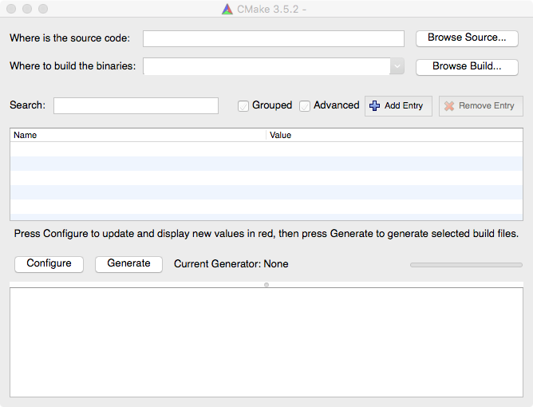
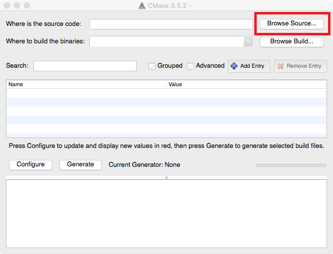
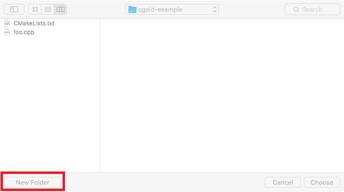
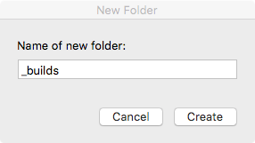
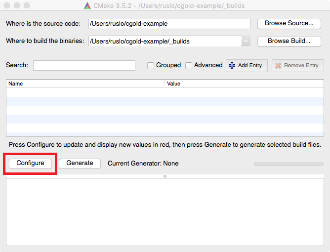
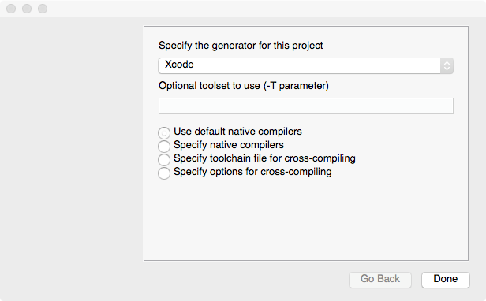
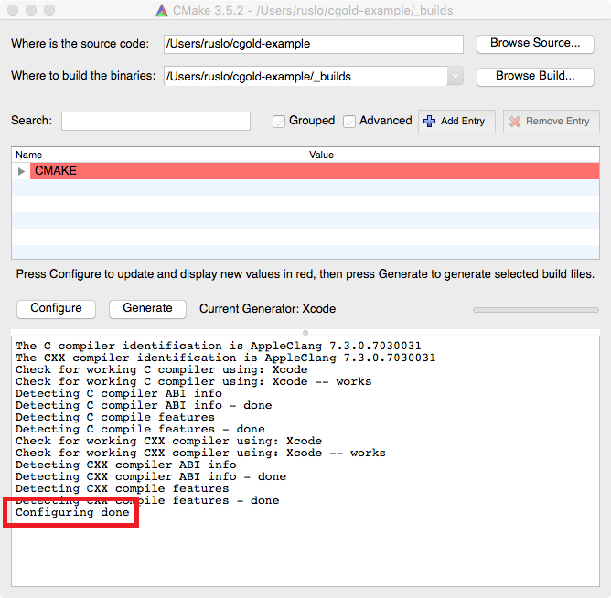
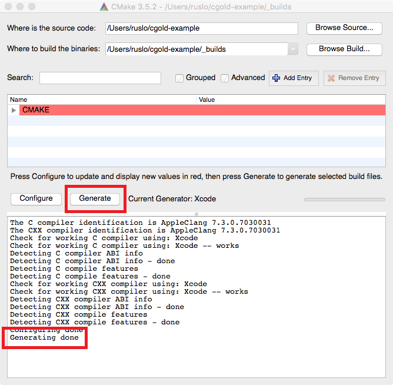
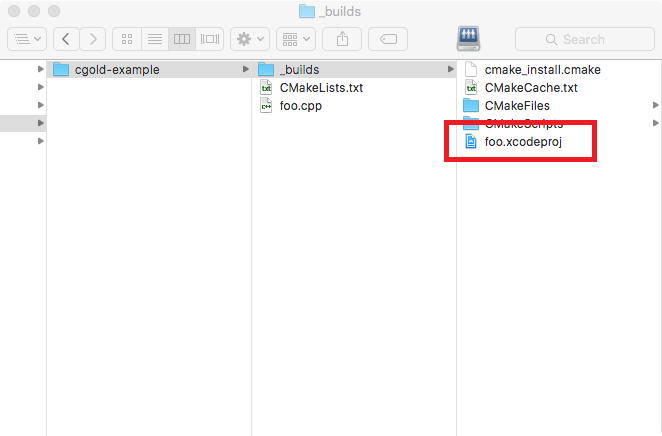

.. Copyright (c) 2016, Ruslan Baratov
.. All rights reserved.

GUI: Xcode
----------

Open CMake GUI:

Click ``Browse Source...`` and find directory with ``CMakeLists.txt`` and ``foo.cpp``:

Now we need to choose directory where to put all temporary files. Let's create
separate directory so we can keep our original directory clean.
Click ``Browse Build..``:

.. image:: xcode-screens/03-browse-build.png
  :align: center

Find directory with ``CMakeLists.txt`` and click ``New Folder`` to create
``_builds`` directory:

Enter ``_builds`` and click ``Create``:

Check the resulted layout:

.. image:: xcode-screens/06-check-layout.png
  :align: center

Click on ``Configure`` to process ``CMakeLists.txt``:

:ref:`CMake <CMake>` will ask for the generator you want to use, pick Xcode:

After you click ``Done`` CMake will run internal tests on build tool to
check that everything works correctly. You can see ``Configuring done``
message when finished:

For now there was no native build tool files generated, on this step user
is able to do additional tuning of the project. We don't want such tuning now so
will run ``Generate``:

Now if you take a look at ``_builds`` folder you can find generated
Xcode project file:

Open ``foo.xcodeproj`` and :doc:`run executable </first-step/run-executable/ide-xcode>`.
