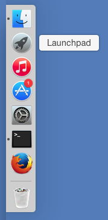
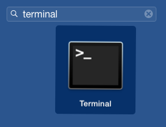
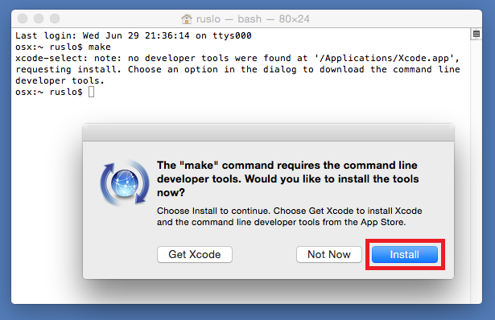
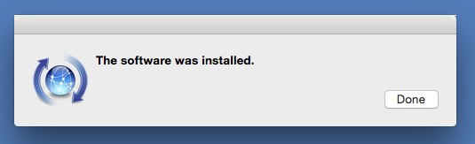

.. Copyright (c) 2016, Ruslan Baratov
.. All rights reserved.

.. spelling::

  Popup

Unix Makefiles
--------------

* CMake option: ``-G "Unix Makefiles"``

.. admonition:: CMake documentation

  * `Unix Makefiles <https://cmake.org/cmake/help/v3.5/generator/Unix%20Makefiles.html>`_

.. admonition:: Wikipedia

  * `Make <https://en.wikipedia.org/wiki/Make_%28software%29>`_

Ubuntu Installation
===================

.. code-block:: none

  > sudo apt-get -y install make
  > make -v
  GNU Make 3.81
  ...

OSX Installation
================

If you're planning to install :doc:`xcode` then install it first. ``make`` and
other tools come with ``Xcode``. Otherwise ``make`` can be installed
with ``Command line tools`` only.

Run ``Launchpad``:

Find ``Terminal`` and launch it:

Try to execute ``make`` (or any other commands for development like GCC, git,
clang, etc.). The following pop-up dialog window will appear:

Click ``Install``. Wait until it has finished with the success message:

.. _osx developer tools installed:

Check ``make`` location and version:

.. code-block:: none

  > which make
  /usr/bin/make

  > make --version
  GNU Make 3.81
  Copyright (C) 2006  Free Software Foundation, Inc.
  This is free software; see the source for copying conditions.
  There is NO warranty; not even for MERCHANTABILITY or FITNESS FOR A
  PARTICULAR PURPOSE.

  This program built for i386-apple-darwin11.3.0

``Clang`` will be installed too:

.. code-block:: none

  > which clang
  /usr/bin/clang

  > clang --version
  Apple LLVM version 7.0.2 (clang-700.1.81)
  Target: x86_64-apple-darwin14.0.0
  Thread model: posix

As well as ``GCC``:

.. code-block:: none

  > which gcc
  /usr/bin/gcc

  > gcc --version
  Configured with: --prefix=/Library/Developer/CommandLineTools/usr --with-gxx-include-dir=/usr/include/c++/4.2.1
  Apple LLVM version 7.0.2 (clang-700.1.81)
  Target: x86_64-apple-darwin14.0.0
  Thread model: posix
