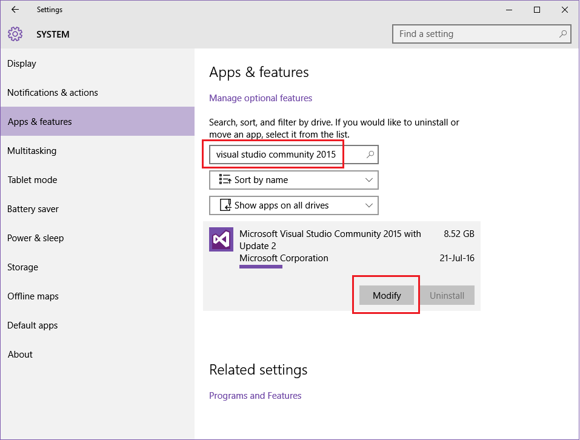
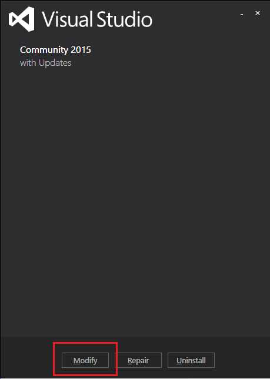

.. Copyright (c) 2016, Ruslan Baratov
.. All rights reserved.

Visual Studio
=============

``Visual Studio`` is an IDE created by ``Microsoft``. Here are the links to the
``*.iso`` images of community versions:

* `Visual Studio Community 2015 <https://go.microsoft.com/fwlink/?LinkId=615448&clcid=0x409>`__ 
* `Visual Studio Community 2013 <https://go.microsoft.com/fwlink/?LinkId=532496&type=ISO&clcid=0x409>`__

.. seealso::

  * `Official site <https://www.visualstudio.com/>`_

.. admonition:: Wikipedia

  * `Visual Studio <https://en.wikipedia.org/wiki/Microsoft_Visual_Studio>`_

.. _manage visual studio features:

Manage features
---------------

Installer will offer to manage features you need. Don't forget to add
:menuselection:`Programming Languages --> Visual C++`:

.. image:: win-screens/visual-cxx.png
  :align: center

If you already have Visual Studio installed you can go to
:menuselection:`System --> Apps & features --> Modify`:

.. seealso::

  * `CMake Tools for Visual Studio <http://cmaketools.codeplex.com/>`__
  * `VsVim <https://visualstudiogallery.msdn.microsoft.com/59ca71b3-a4a3-46ca-8fe1-0e90e3f79329>`__
  * `Editor Guidelines <https://visualstudiogallery.msdn.microsoft.com/da227a0b-0e31-4a11-8f6b-3a149cf2e459>`__
