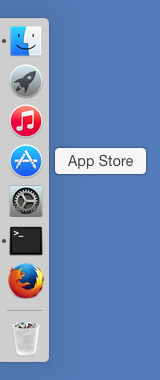
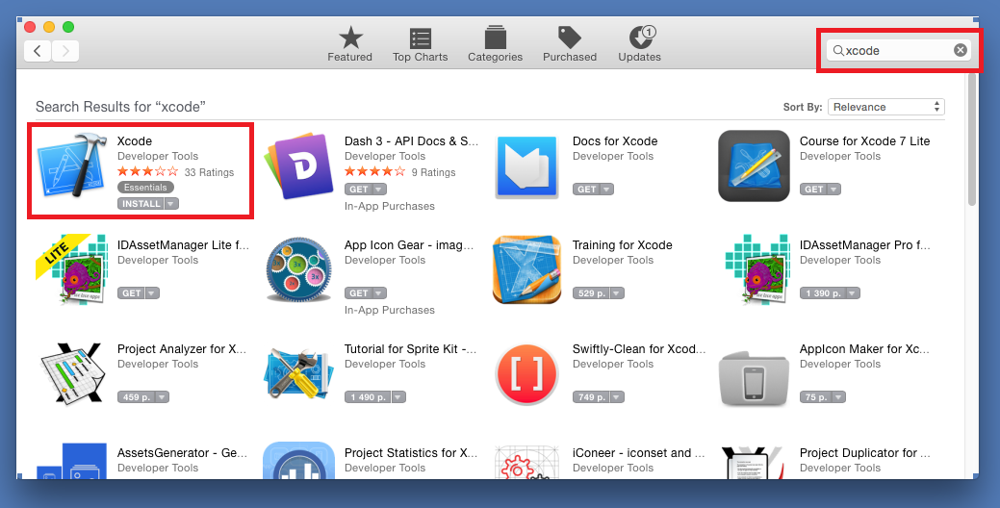
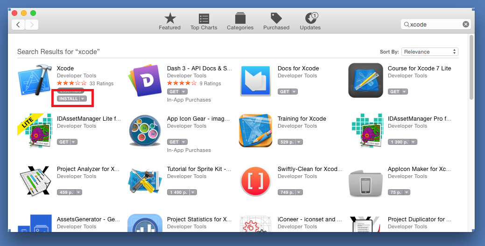
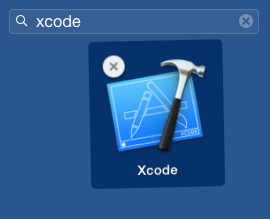
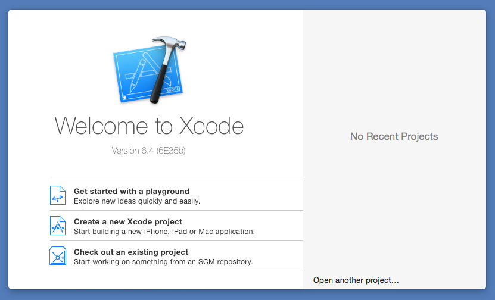

.. Copyright (c) 2016, Ruslan Baratov
.. All rights reserved.

Xcode
=====

``Xcode`` is an IDE for OSX/iOS development (`Wikipedia <https://en.wikipedia.org/wiki/Xcode>`__).

Default install with App Store
~~~~~~~~~~~~~~~~~~~~~~~~~~~~~~

Go to ``App Store``:

Search for ``Xcode`` application:

Run install:

After successful install run ``Launchpad``:

.. image:: osx-screens/xcode/04-launchpad.png
  :align: center

Search for ``Xcode`` and launch it:

Success!

.. note::

  Other developer tools is :ref:`installed now too <osx developer tools installed>`.

Several/custom Xcode versions
~~~~~~~~~~~~~~~~~~~~~~~~~~~~~

If you want to have several ``Xcode`` versions simultaneously for testing
purposes or you want the exact version of ``Xcode`` you can download/install
it manually from `Apple Developers site <https://developer.apple.com/download/more/>`_.

For example:

.. code-block:: shell

  > ls /Applications/develop/ide/xcode
  4.6.3/
  5.0.2/
  6.1/
  6.4/
  7.2/
  7.2.1/
  7.3.1/

Default directory and version can be checked by ``xcode-select``/``xcodebuild`` tools:

.. code-block:: shell

  > xcode-select --print-path
  /Applications/develop/ide/xcode/7.3.1/Xcode.app/Contents/Developer

  > xcodebuild -version
  Xcode 7.3.1
  Build version 7D1014

Default version can be changed by ``xcode-select -switch``:

.. code-block:: shell

  > sudo xcode-select -switch /Applications/develop/ide/xcode/7.2/Xcode.app/Contents/Developer

  > xcodebuild -version
  Xcode 7.2
  Build version 7C68

Or using environment variable ``DEVELOPER_DIR``:

.. code-block:: shell

  > export DEVELOPER_DIR=/Applications/develop/ide/xcode/7.3.1/Xcode.app/Contents/Developer
  > xcodebuild -version
  Xcode 7.3.1
  Build version 7D1014

  > export DEVELOPER_DIR=/Applications/develop/ide/xcode/7.2/Xcode.app/Contents/Developer
  > xcodebuild -version
  Xcode 7.2
  Build version 7C68

.. seealso::

  * `Polly iOS toolchains <https://github.com/ruslo/polly/wiki/Toolchain-list#ios>`_
