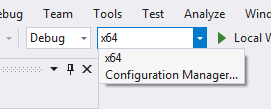
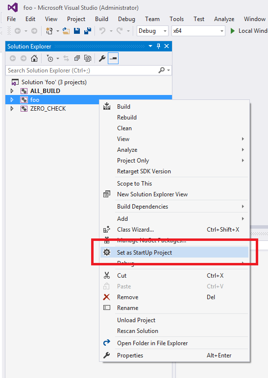
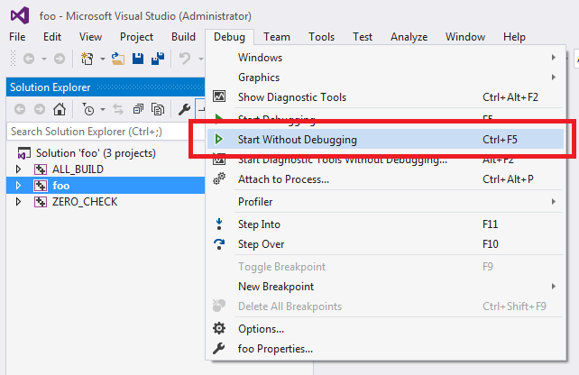
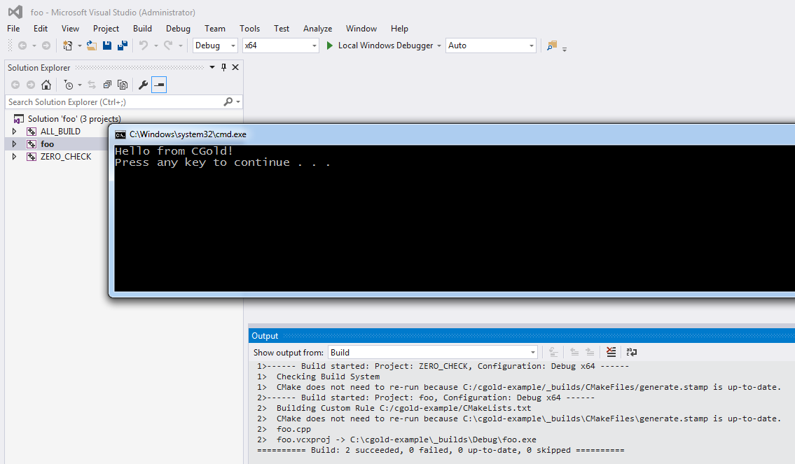

.. Copyright (c) 2016, Ruslan Baratov
.. All rights reserved.

IDE: Visual Studio
------------------

Since we used ``* Win64`` generator, the target's architecture is ``x64``:

We need to tell Visual Studio that the target we want to run is ``foo``. This can
be done by right clicking on ``foo`` target in ``Solution Explorer`` and
choosing ``Set as StartUp Project``:

To run the executable go to :menuselection:`Debug --> Start Without Debugging`:

Visual Studio will build the target first and then execute it:

Done!
