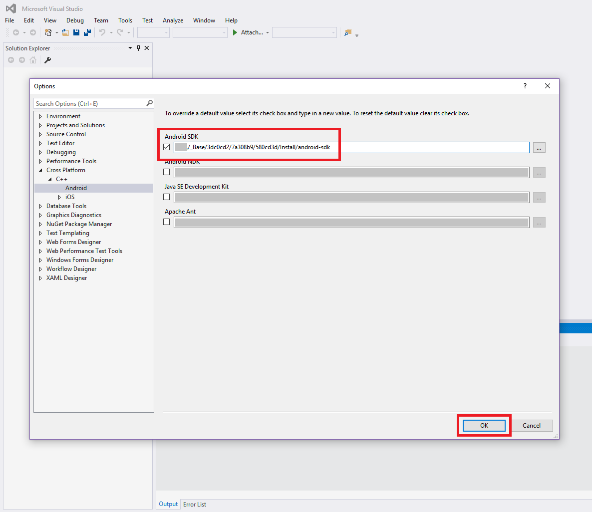
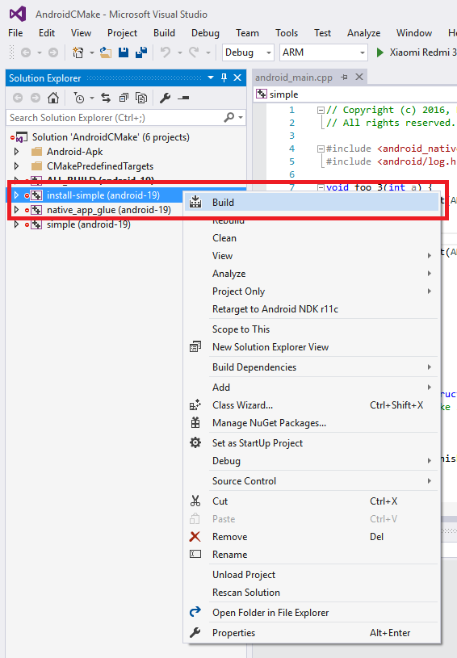
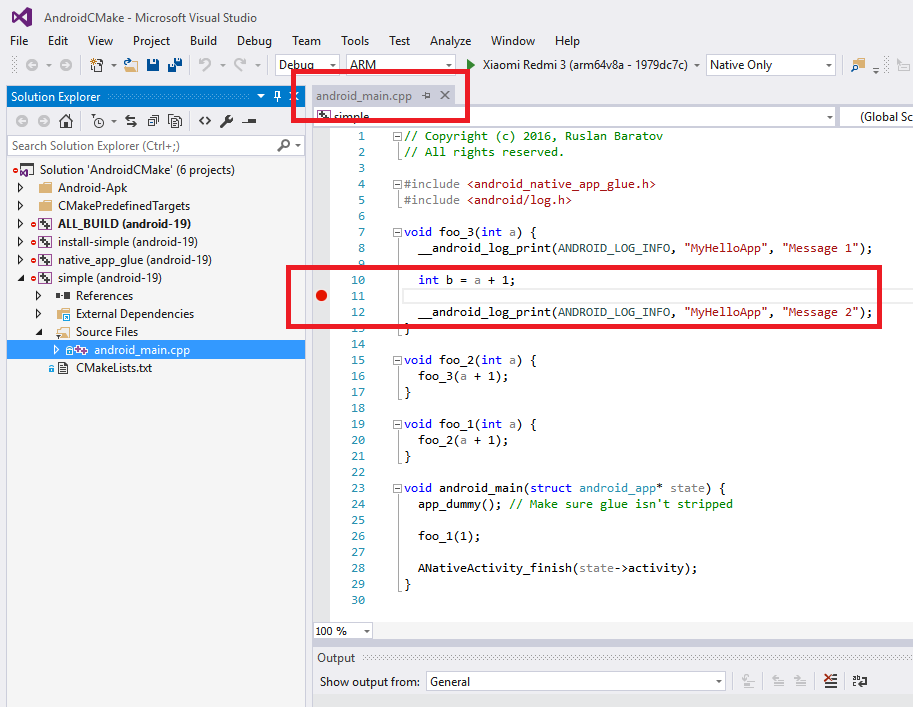
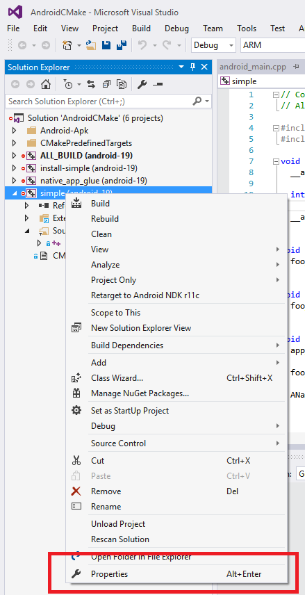
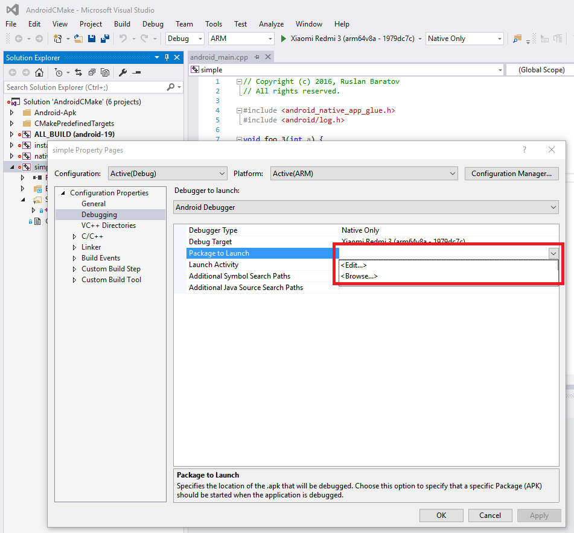
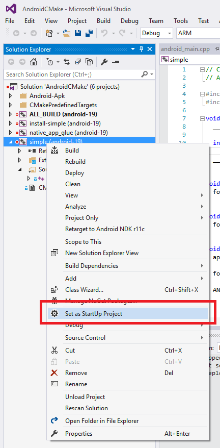
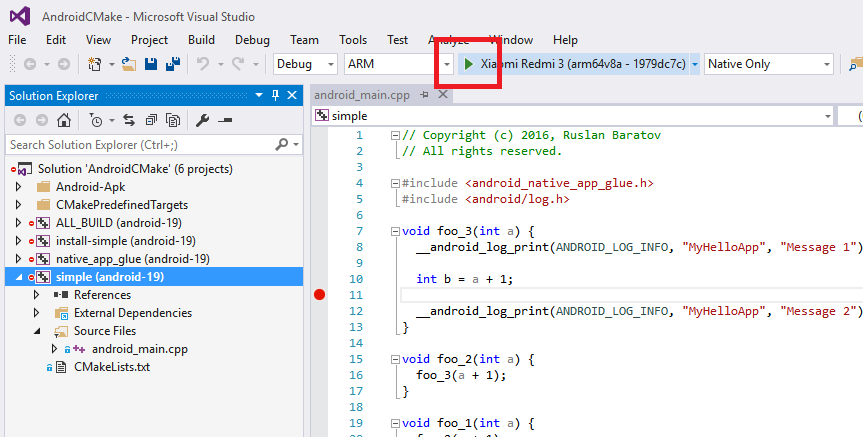

.. Copyright (c) 2016, Ruslan Baratov
.. All rights reserved.

.. spelling::

  logcat

Windows Host
------------

.. seealso::

  * `Support for Android CMake projects in Visual Studio <https://blogs.msdn.microsoft.com/vcblog/2015/12/15/support-for-android-cmake-projects-in-visual-studio/>`__

Required components
===================

Install :ref:`additional components <manage visual studio features>` first.

:menuselection:`Cross Platform Mobile Development --> Visual C++ Mobile Development`:

.. image:: win-screens/01-mobile-dev.png
  :align: center

And :menuselection:`Cross Platform Mobile Development --> Common Tools and Software Development Kits --> Android Native Development Kit *`:

.. image:: win-screens/02-android-ndk.png
  :align: center

Click ``Update``:

.. image:: win-screens/03-update.png
  :align: center

Wait until finished:

.. image:: win-screens/04-wait.png
  :align: center

Restart may required:

.. image:: win-screens/05-restart.png
  :align: center

Experimental CMake
==================

Build experimental CMake version from ``feature/VCMDDAndroid`` branch of
``Microsoft/CMake`` repository: https://github.com/Microsoft/CMake/tree/feature/VCMDDAndroid.

You can download
`ZIP archive <https://github.com/ruslo/CMake/releases/download/v3.4.2-android/cmake-3.4.2-win32-x86.zip>`__
with binaries from `here <https://github.com/ruslo/CMake/releases/tag/v3.4.2-android>`__.

Unpack archive and add ``bin`` directory to PATH environment variable.
Verify by ``where cmake`` that you're using experimental version.

Example
=======

.. admonition:: Examples on GitHub

  * `Repository <https://github.com/cgold-examples/platforms-android-on-windows>`__
  * `Latest ZIP <https://github.com/cgold-examples/platforms-android-on-windows/archive/master.zip>`__

.. literalinclude:: /examples/platforms-android-on-windows/CMakeLists.txt
  :language: cmake
  :emphasize-lines: 1, 14, 17, 19

Generate:

.. code-block:: shell
  :emphasize-lines: 1, 5, 11

  [platforms-android-on-windows]> cmake -H. -B_builds "-GVisual Studio 14 2015 ARM"
  -- The C compiler identification is Clang 3.6.0
  -- The CXX compiler identification is Clang 3.6.0
  -- Check for working C compiler using: Visual Studio 14 2015 ARM
  -- Check for working C compiler using: Visual Studio 14 2015 ARM -- works
  -- Detecting C compiler ABI info
  -- Detecting C compiler ABI info - done
  -- Detecting C compile features
  -- Detecting C compile features - done
  -- Check for working CXX compiler using: Visual Studio 14 2015 ARM
  -- Check for working CXX compiler using: Visual Studio 14 2015 ARM -- works
  -- Detecting CXX compiler ABI info
  -- Detecting CXX compiler ABI info - done
  -- Detecting CXX compile features
  -- Detecting CXX compile features - done
  -- Configuring done
  -- Generating done
  -- Build files have been written to: C:/.../platforms-android-on-windows/_builds

Build:

.. code-block:: shell
  :emphasize-lines: 1, 12, 14-19, 21

  [platforms-android-on-windows]> cmake --build _builds --config Debug
  Microsoft (R) Build Engine version 14.0.25420.1
  Copyright (C) Microsoft Corporation. All rights reserved.

  ...

  CustomBuild:
    Building Custom Rule C:/.../platforms-android-on-windows/CMakeLists.txt
    CMake does not need to re-run because C:\...\platforms-android-on-windows\_builds\CMakeFiles\generate.stamp is up-to-date.
  ClCompile:

    C:\ProgramData\Microsoft\AndroidNDK64\android-ndk-r10e\toolchains\llvm-3.6\prebuilt\windows-x86_64\bin\clang.exe
    ...
    --sysroot="C:\ProgramData\Microsoft\AndroidNDK64\android-ndk-r10e\platforms\android-19\arch-arm"
    -I "C:\ProgramData\Microsoft\AndroidNDK64\android-ndk-r10e\platforms\android-19\arch-arm\usr\include"
    -I "C:\ProgramData\Microsoft\AndroidNDK64\android-ndk-r10e\sources\cxx-stl\gnu-libstdc++\4.9\include"
    -I "C:\ProgramData\Microsoft\AndroidNDK64\android-ndk-r10e\sources\cxx-stl\gnu-libstdc++\4.9\libs\armeabi-v7a\include"
    -I "C:\ProgramData\Microsoft\AndroidNDK64\android-ndk-r10e\sources\cxx-stl\gnu-libstdc++\4.9\include\backward"
    -I "C:\ProgramData\Microsoft\AndroidNDK64\android-ndk-r10e\toolchains\llvm-3.6\prebuilt\windows-x86_64\lib\clang\3.6\include"
    ...
    "C:\...\platforms-android-on-windows\foo.cpp"

  foo.cpp
  Lib:

  ...

  Build succeeded.
      0 Warning(s)
      0 Error(s)

  Time Elapsed 00:00:01.04

Errors
======

Platform not found
~~~~~~~~~~~~~~~~~~

If you see error like that:

.. code-block:: shell

  [platforms-android-on-windows]> cmake -H. -B_builds "-GVisual Studio 14 2015 ARM"
  CMake Error at CMakeLists.txt:7 (message):
    File not found:

      C:/.../Modules/Platform/VCMDDAndroid.cmake

    You are using non-patched CMake version!

It means you are not using experimental version. Check your ``PATH`` variable.

MDD not installed
~~~~~~~~~~~~~~~~~

If you haven't install
:menuselection:`Cross Platform Mobile Development --> Visual C++ Mobile Development`
you will see this error:

.. code-block:: shell

  [platforms-android-on-windows]> cmake -H. -B_builds "-GVisual Studio 14 2015 ARM"
  CMake Error at CMakeLists.txt:17 (project):
    CMAKE_SYSTEM_NAME is 'VCMDDAndroid' but 'Visual C++ for Mobile Development
    (Android support)' is not installed.

Compiler not found
~~~~~~~~~~~~~~~~~~

Check for
:menuselection:`Cross Platform Mobile Development --> Common Tools and Software Development Kits --> Android Native Development Kit *`
if you see this error:

.. code-block:: shell

  [platforms-android-on-windows]> cmake -H. -B_builds "-GVisual Studio 14 2015 ARM"
  -- The C compiler identification is unknown
  -- The CXX compiler identification is unknown
  CMake Error at CMakeLists.txt:17 (project):
    No CMAKE_C_COMPILER could be found.

  CMake Error at CMakeLists.txt:17 (project):
    No CMAKE_CXX_COMPILER could be found.

.. admonition:: Polly

  * `Android toolchains <http://polly.readthedocs.io/en/latest/toolchains/android.html>`__

Debugging with Visual Studio
============================

.. warning::

  * Android with CMake support is in preliminary state so everything
    looks hacky.

Prepare
~~~~~~~

Install Polly if not already installed and add to PATH:

.. code-block:: shell

  > git clone https://github.com/ruslo/polly
  > set PATH=%cd%\polly\bin;%PATH%
  > where polly.py
  C:\...\polly\bin\polly.py

Check VC MDD version of CMake used (see notes above):

.. code-block:: shell

  > where cmake
  C:\...\cmake-3.4.2-win32-x86\bin\cmake.exe

Clone projects:

.. code-block:: shell

  > git clone https://github.com/forexample/android-cmake
  > cd android-cmake\09-vc-mdd-debug
  [09-vc-mdd-debug]>

Verify that your device connected and visible, check CPU and API version fit
toolchain that will be used (see :doc:`General Hints </platforms/android/hints>`).

Android SDK
~~~~~~~~~~~

Now we will run CMake. This will trigger Hunter instructions that will download
all dependencies. Do not run build for now and don't open Visual Studio
project, we are interested in Android SDK path first:

.. code-block:: shell
  :emphasize-lines: 8

  [09-vc-mdd-debug]> build.py --toolchain android-vc-ndk-r10e-api-19-arm-clang-3-6 --verbose --nobuild
  ...
  -- [hunter *** DEBUG *** ...] Package already installed: Android-SDK
  -- [hunter *** DEBUG *** ...] load: C:/.../cmake/projects/Android-SDK/hunter.cmake ... end
  -- Path to `android`: C:/.../Install/android-sdk/tools/android
  -- Path to `emulator`: C:/.../Install/android-sdk/tools/emulator
  -- Path to `adb`: C:/.../Install/android-sdk/platform-tools/adb
  -- Tools -> Options -> Cross Platform -> C++ -> Android: C:/.../Install/android-sdk
  -- [hunter *** DEBUG *** ...] load: C:/.../cmake/projects/Android-Modules/hunter.cmake
  -- [hunter *** DEBUG *** ...] Android-Modules versions available: [1.0.0]

Copy path ``C:/.../Install/android-sdk`` to clipboard and open Visual Studio.
There is no way to control Android SDK path by CMake code so we have to
add this path manually to

* :menuselection:`Tools --> Options --> Cross Platform --> C++ --> Android`

Click OK and exit.

.. note::

  It need to be done only once. Note that this setting is global so it will
  be used in other Visual Studio projects (they may not use Hunter or CMake).

APK Create
~~~~~~~~~~

Run CMake again, this time use ``--open`` to open generated
Visual Studio solution:

.. code-block:: shell

  [09-vc-mdd-debug]> build.py --toolchain android-vc-ndk-r10e-api-19-arm-clang-3-6 --verbose --nobuild --open

Find ``install-simple`` target and build it. This will trigger creating APK
and installing it on device:

.. warning::

  This step is necessary **always** before running application on device,
  otherwise old APK will be used and new updates will not be visible!

Breakpoints
~~~~~~~~~~~

Let's find ``android_main.cpp`` source file, open it and set breakpoint to
the function ``foo_3`` before printing ``Message 2``:

APK path
~~~~~~~~

We have to tell Visual Studio which APK file we are debugging.
Go to the ``Properties``:

Find ``Package to Launch`` in ``Debugging``:

And find ``simple-debug.apk`` in ``apk/bin`` folder:

.. image:: visual-studio-screens/06-find-apk.png
  :align: center

Now set this project as StartUp:

Run
~~~

We are ready to run!

Debugger stops right after ``Message 1`` and before ``Message 2``.
Screenshot with call stack, logcat and values of local variables ``a`` and ``b``:

.. image:: visual-studio-screens/09-breakpoint.png
  :align: center
