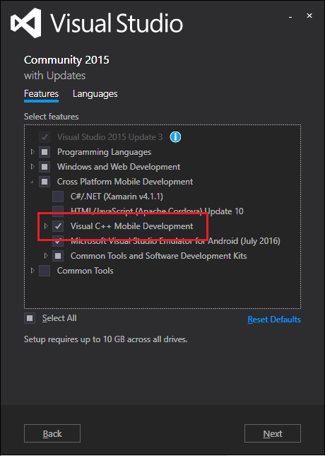
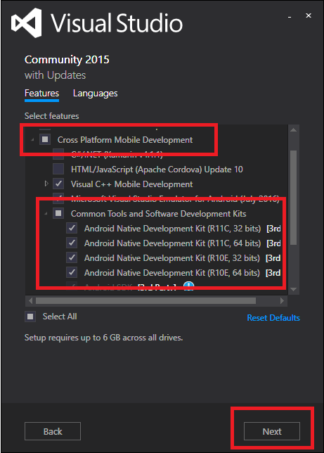
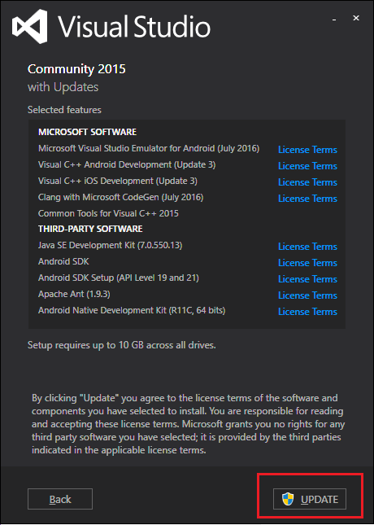
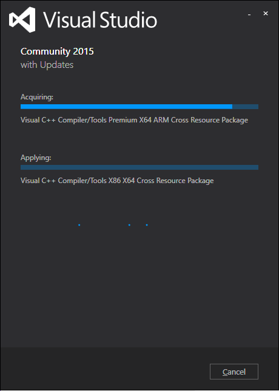
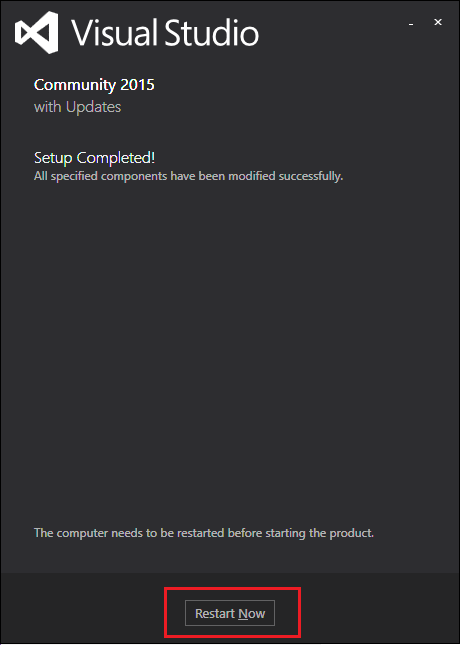

.. Copyright (c) 2016, Ruslan Baratov
.. All rights reserved.

Windows Host
------------

.. seealso::

  * `Support for Android CMake projects in Visual Studio <https://blogs.msdn.microsoft.com/vcblog/2015/12/15/support-for-android-cmake-projects-in-visual-studio/>`__

Required components
===================

Install :ref:`additional components <manage visual studio features>` first.

:menuselection:`Cross Platform Mobile Development --> Visual C++ Mobile Development`:

and :menuselection:`Cross Platform Mobile Development --> Common Tools and Software Development Kits --> Android Native Development Kit *`:

Click ``Update``:

Wait until finished:

Restart may required:

Experimental CMake
==================

Build experimental CMake version from ``feature/VCMDDAndroid`` branch of
``Microsoft/CMake`` repository: https://github.com/Microsoft/CMake/tree/feature/VCMDDAndroid.

You can download
`ZIP archive <https://github.com/ruslo/CMake/releases/download/v3.4.2-android/cmake-3.4.2-win32-x86.zip>`__
with binaries from `here <https://github.com/ruslo/CMake/releases/tag/v3.4.2-android>`__.

Unpack archive and add ``bin`` directory to PATH environment variable.
Verify by ``where cmake`` that you're using experimental version.

Example
=======

.. admonition:: Examples on GitHub

  * `Repository <https://github.com/cgold-examples/platforms-android-on-windows>`__
  * `Latest ZIP <https://github.com/cgold-examples/platforms-android-on-windows/archive/master.zip>`__

Build example:

.. code-block:: shell

  [platforms-android-on-windows]> cmake -H. -B_builds "-GVisual Studio 14 2015 ARM"
  [platforms-android-on-windows]> cmake --build _builds --config Debug

Errors
======

Platform not found
~~~~~~~~~~~~~~~~~~

If you see error like that:

.. code-block:: shell

  [platforms-android-on-windows]> cmake -H. -B_builds "-GVisual Studio 14 2015 ARM"
  CMake Error at CMakeLists.txt:7 (message):
    File not found:

      C:/.../Modules/Platform/VCMDDAndroid.cmake

    You are using non-patched CMake version!

It means you are not using experimental version. Check your ``PATH`` variable.

MDD not installed
~~~~~~~~~~~~~~~~~

If you haven't install
:menuselection:`Cross Platform Mobile Development --> Visual C++ Mobile Development`
you will see this error:

.. code-block:: shell

  [platforms-android-on-windows]> cmake -H. -B_builds "-GVisual Studio 14 2015 ARM"
  CMake Error at CMakeLists.txt:17 (project):
    CMAKE_SYSTEM_NAME is 'VCMDDAndroid' but 'Visual C++ for Mobile Development
    (Android support)' is not installed.

Compiler not found
~~~~~~~~~~~~~~~~~~

Check for
:menuselection:`Cross Platform Mobile Development --> Common Tools and Software Development Kits --> Android Native Development Kit *`
if you see this error:

.. code-block:: shell

  [platforms-android-on-windows]> cmake -H. -B_builds "-GVisual Studio 14 2015 ARM"
  -- The C compiler identification is unknown
  -- The CXX compiler identification is unknown
  CMake Error at CMakeLists.txt:17 (project):
    No CMAKE_C_COMPILER could be found.

  CMake Error at CMakeLists.txt:17 (project):
    No CMAKE_CXX_COMPILER could be found.
