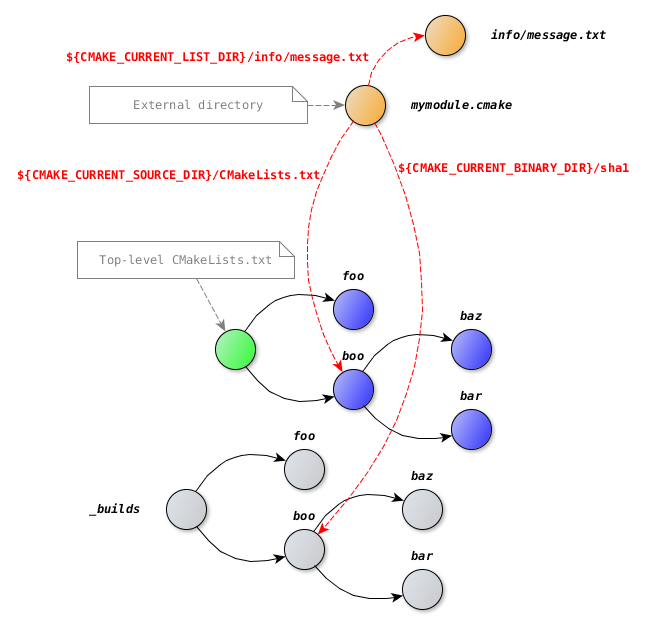

.. Copyright (c) 2016-2018, Ruslan Baratov
.. All rights reserved.

Common variables
================

Since every ``CMakeLists.txt`` is a :ref:`listfile <listfile>` hence the common
listfile variables like ``CMAKE_CURRENT_LIST_DIR`` or
``CMAKE_CURRENT_LIST_FILE`` are available. For ``CMakeLists.txt`` added by
``add_subdirectory`` there will be no difference between
``CMAKE_CURRENT_LIST_DIR`` and ``CMAKE_CURRENT_SOURCE_DIR``, also
``CMAKE_CURRENT_LIST_FILE`` will be always a full path to ``CMakeLists.txt``.
However it's not always true for other types of CMake listfiles.

.. admonition:: CMake documentation

  * `CMAKE_CURRENT_LIST_DIR <https://cmake.org/cmake/help/latest/variable/CMAKE_CURRENT_LIST_DIR.html>`__
  * `CMAKE_CURRENT_LIST_FILE <https://cmake.org/cmake/help/latest/variable/CMAKE_CURRENT_LIST_FILE.html>`__
  * `CMAKE_CURRENT_LIST_LINE <https://cmake.org/cmake/help/latest/variable/CMAKE_CURRENT_LIST_LINE.html>`__

CMAKE_CURRENT_LIST_*
--------------------

Information about any kind of listfile can be taken from
``CMAKE_CURRENT_LIST_FILE`` and ``CMAKE_CURRENT_LIST_DIR`` variables:

.. literalinclude:: /examples/cmake-sources/path-to-module/CMakeLists.txt
  :language: cmake
  :emphasize-lines: 6, 8

.. literalinclude:: /examples/cmake-sources/path-to-module/cmake/mymodule.cmake
  :language: cmake
  :emphasize-lines: 3-4

.. code-block:: none
  :emphasize-lines: 3-4

  [cmake-sources]> rm -rf _builds
  [cmake-sources]> cmake -Hpath-to-module -B_builds
  Full path to module: /.../cmake-sources/path-to-module/cmake/mymodule.cmake
  Module located in directory: /.../cmake-sources/path-to-module/cmake
  -- Configuring done
  -- Generating done
  -- Build files have been written to: /.../cmake-sources/_builds

CMAKE_CURRENT_LIST_DIR vs CMAKE_CURRENT_SOURCE_DIR
--------------------------------------------------

The difference between those two variables is about type of information they
provide. A ``CMAKE_CURRENT_SOURCE_DIR`` variable describes **a source tree** and
should be read as *a current source tree directory*.
Here is a list of sibling variables describing source/binary trees:

* CMAKE_SOURCE_DIR
* CMAKE_BINARY_DIR
* PROJECT_SOURCE_DIR
* PROJECT_BINARY_DIR
* **CMAKE_CURRENT_SOURCE_DIR**
* CMAKE_CURRENT_BINARY_DIR

The next files **always** exist:

* ``${CMAKE_SOURCE_DIR}/CMakeLists.txt``
* ``${CMAKE_BINARY_DIR}/CMakeCache.txt``
* ``${PROJECT_SOURCE_DIR}/CMakeLists.txt``
* ``${CMAKE_CURRENT_SOURCE_DIR}/CMakeLists.txt``

A ``CMAKE_CURRENT_LIST_DIR`` variable describes **a current listfile** (it is not
necessarily ``CMakeLists.txt``, it can be ``somemodule.cmake``), and should
be read as *a directory of a currently processed listfile*, i.e.
directory of ``CMAKE_CURRENT_LIST_FILE``. Here is another list of sibling
variables:

* CMAKE_CURRENT_LIST_FILE
* CMAKE_CURRENT_LIST_LINE
* **CMAKE_CURRENT_LIST_DIR**
* CMAKE_PARENT_LIST_FILE

Example
-------

Assume we have an external CMake module that calculates SHA1 of CMakeLists.txt
and saves it with some custom info to a ``sha1`` file in a current binary directory:

.. literalinclude:: /examples/cmake-sources/with-external-module/external/mymodule.cmake
  :language: cmake

``mymodule.cmake`` uses some resource. Resource ``info/message.txt``
is a file with content:

.. literalinclude:: /examples/cmake-sources/with-external-module/external/info/message.txt
  :language: none

To read this resource we must use ``CMAKE_CURRENT_LIST_DIR`` because file
located **in same external directory** as module:

.. literalinclude:: /examples/cmake-sources/with-external-module/external/mymodule.cmake
  :language: cmake
  :emphasize-lines: 3

To read CMakeLists.txt we must use ``CMAKE_CURRENT_SOURCE_DIR`` because
CMakeLists.txt located **in source directory**:

.. literalinclude:: /examples/cmake-sources/with-external-module/external/mymodule.cmake
  :language: cmake
  :emphasize-lines: 4

Subdirectory ``boo`` uses this module:

.. literalinclude:: /examples/cmake-sources/with-external-module/example/boo/CMakeLists.txt
  :language: cmake
  :emphasize-lines: 8

.. code-block:: none

  [cmake-sources]> rm -rf _builds
  [cmake-sources]> cmake -Hwith-external-module/example -B_builds -DCMAKE_MODULE_PATH=`pwd`/with-external-module/external
  Top level CMakeLists.txt
  Processing foo/CMakeList.txt
  Processing boo/CMakeList.txt
  Processing boo/baz/CMakeLists.txt
  Processing boo/bar/CMakeLists.txt
  -- Configuring done
  -- Generating done
  -- Build files have been written to: /.../cmake-sources/_builds

Check a ``sha1`` file created by the module:

.. code-block:: none
  :emphasize-lines: 4

  [cmake-sources]> cat _builds/boo/sha1
  Message from external module

  sha1(CMakeLists.txt) = 9f0ceda4ca514a074589fc7591aad0635b6565eb

Verify a value manually:

.. code-block:: none
  :emphasize-lines: 2

  [cmake-sources]> openssl sha1 with-external-module/example/boo/CMakeLists.txt
  SHA1(with-external-module/example/boo/CMakeLists.txt)= 9f0ceda4ca514a074589fc7591aad0635b6565eb

This diagram will make everything clear:

Recommendation
--------------

Instead of keeping in a head all this information you can remember just two
variables:

* ``CMAKE_CURRENT_LIST_DIR``
* ``CMAKE_CURRENT_BINARY_DIR``

Note that *in functions* a ``CMAKE_CURRENT_LIST_DIR`` variable is set to the
directory where a function **is used**, not where
a function **is defined** (see :ref:`function <function list dir>` for details).

Use ``CMAKE_CURRENT_BINARY_DIR`` for storing generated files.

.. warning::

  Do not use ``CMAKE_CURRENT_BINARY_DIR`` for figuring out the full path
  to objects that was build by native tool, e.g. using
  ``${CMAKE_CURRENT_BINARY_DIR}/foo.exe`` is a bad idea since for Linux
  executable will be named ``${CMAKE_CURRENT_BINARY_DIR}/foo`` and for multi-configuration
  generators it will be like
  ``${CMAKE_CURRENT_BINARY_DIR}/Debug/foo.exe`` and really should be determined
  on a build step instead of generate step. In such cases
  :doc:`generator expressions </tutorials/generator-expressions>` is helpful.
  For example
  `$<TARGET_FILE:tgt> <https://cmake.org/cmake/help/latest/manual/cmake-generator-expressions.7.html#informational-expressions>`__.

Make sure you **fully understand** what each variable means in other scenarios:

* ``CMAKE_SOURCE_DIR``/``CMAKE_BINARY_DIR`` these variables point to the root
  of the source/binary trees. If your project will be added to another project
  as a subproject by ``add_subdirectory``, the locations like
  ``${CMAKE_SOURCE_DIR}/my-resource.txt`` will point to
  ``<top-level>/my-resource.txt`` instead of ``<my-project>/my-resource.txt``

* ``PROJECT_SOURCE_DIR``/``PROJECT_BINARY_DIR`` these variables are better
  then previous but still have kind of a global nature. You should change all
  paths related to ``PROJECT_SOURCE_DIR`` if you decide to move declaration of
  your project or decide to detach some part of the code and add new
  ``project`` command in the middle of the source tree. Consider using extra
  variable with clean separate purpose for such job
  ``set(FOO_MY_RESOURCES "${CMAKE_CURRENT_LIST_DIR}/resources")`` instead of
  referring to ``${PROJECT_SOURCE_DIR}/resources``.

* ``CMAKE_CURRENT_SOURCE_DIR`` this is a directory with ``CMakeLists.txt``.
  If you're using this variable internally you can substitute is with
  ``CMAKE_CURRENT_LIST_DIR``. In case you're creating module for external usage
  consider moving all functionality to ``function``.

With this recommendation previous example can be rewritten in next way:

.. literalinclude:: /examples/cmake-sources/with-external-module-good/external/mymodule.cmake
  :language: cmake
  :emphasize-lines: 3-5, 8-10

.. note::

  As you may notice we don't have to use ``_long_variable`` names since function
  has it's own scope.

And call a ``mymodule`` function instead of including a module:

.. literalinclude:: /examples/cmake-sources/with-external-module-good/example/boo/CMakeLists.txt
  :language: cmake
  :emphasize-lines: 8

Effect is the same:

.. code-block:: none
  :emphasize-lines: 3, 6

  [cmake-sources]> cat _builds/boo/sha1
  Message from external module
  sha1(CMakeLists.txt) = 36bcbf5f2f23995661ca4e6349e781160910b71f

  [cmake-sources]> openssl sha1 with-external-module-good/example/boo/CMakeLists.txt
  SHA1(with-external-module-good/example/boo/CMakeLists.txt)= 36bcbf5f2f23995661ca4e6349e781160910b71f
