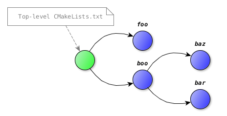
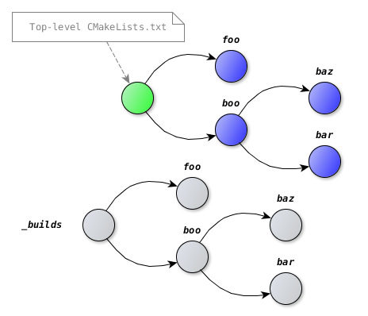

.. Copyright (c) 2016, Ruslan Baratov
.. All rights reserved.

Subdirectories
==============

Tree
----

:ref:`CMakeLists.txt <cmakelists.txt>` loaded by ``add_subdirectory`` command
creates a node in a source tree:

.. literalinclude:: /examples/cmake-sources/simple-tree/CMakeLists.txt
  :language: cmake
  :emphasize-lines: 6, 8-9

.. literalinclude:: /examples/cmake-sources/simple-tree/foo/CMakeLists.txt
  :language: cmake
  :emphasize-lines: 3

.. literalinclude:: /examples/cmake-sources/simple-tree/boo/CMakeLists.txt
  :language: cmake
  :emphasize-lines: 3, 5-6

.. literalinclude:: /examples/cmake-sources/simple-tree/boo/bar/CMakeLists.txt
  :language: cmake
  :emphasize-lines: 3

.. literalinclude:: /examples/cmake-sources/simple-tree/boo/baz/CMakeLists.txt
  :language: cmake
  :emphasize-lines: 3

.. code-block:: none
  :emphasize-lines: 3-7

  [cmake-sources]> rm -rf _builds
  [cmake-sources]> cmake -Ssimple-tree -B_builds
  Top level CMakeLists.txt
  Processing foo/CMakeList.txt
  Processing boo/CMakeList.txt
  Processing boo/baz/CMakeLists.txt
  Processing boo/bar/CMakeLists.txt
  -- Configuring done
  -- Generating done
  -- Build files have been written to: /.../cmake-sources/_builds

Source variables
----------------

``CMAKE_CURRENT_SOURCE_DIR`` variable will hold a full path to a currently
processed node. Root of the tree is always available in
``CMAKE_SOURCE_DIR`` (see :ref:`-S <-S>`):

.. literalinclude:: /examples/cmake-sources/simple-tree-source-vars/CMakeLists.txt
  :language: cmake
  :emphasize-lines: 7-8

.. literalinclude:: /examples/cmake-sources/simple-tree-source-vars/foo/CMakeLists.txt
  :language: cmake
  :emphasize-lines: 4-5

.. literalinclude:: /examples/cmake-sources/simple-tree-source-vars/boo/CMakeLists.txt
  :language: cmake
  :emphasize-lines: 4-5

.. literalinclude:: /examples/cmake-sources/simple-tree-source-vars/boo/bar/CMakeLists.txt
  :language: cmake
  :emphasize-lines: 4-5

.. literalinclude:: /examples/cmake-sources/simple-tree-source-vars/boo/baz/CMakeLists.txt
  :language: cmake
  :emphasize-lines: 4-5

.. code-block:: none
  :emphasize-lines: 4-5, 7-8, 10-11, 13-14, 16-17

  [cmake-sources]> rm -rf _builds
  [cmake-sources]> cmake -Ssimple-tree-source-vars -B_builds
  Top level CMakeLists.txt
  CMAKE_SOURCE_DIR: /.../cmake-sources/simple-tree-source-vars
  CMAKE_CURRENT_SOURCE_DIR: /.../cmake-sources/simple-tree-source-vars
  Processing foo/CMakeList.txt
  CMAKE_SOURCE_DIR: /.../cmake-sources/simple-tree-source-vars
  CMAKE_CURRENT_SOURCE_DIR: /.../cmake-sources/simple-tree-source-vars/foo
  Processing boo/CMakeList.txt
  CMAKE_SOURCE_DIR: /.../cmake-sources/simple-tree-source-vars
  CMAKE_CURRENT_SOURCE_DIR: /.../cmake-sources/simple-tree-source-vars/boo
  Processing boo/baz/CMakeLists.txt
  CMAKE_SOURCE_DIR: /.../cmake-sources/simple-tree-source-vars
  CMAKE_CURRENT_SOURCE_DIR: /.../cmake-sources/simple-tree-source-vars/boo/baz
  Processing boo/bar/CMakeLists.txt
  CMAKE_SOURCE_DIR: /.../cmake-sources/simple-tree-source-vars
  CMAKE_CURRENT_SOURCE_DIR: /.../cmake-sources/simple-tree-source-vars/boo/bar
  -- Configuring done
  -- Generating done
  -- Build files have been written to: /.../cmake-sources/_builds

.. admonition:: CMake documentation

  * `CMAKE_SOURCE_DIR <https://cmake.org/cmake/help/latest/variable/CMAKE_SOURCE_DIR.html>`__
  * `CMAKE_CURRENT_SOURCE_DIR <https://cmake.org/cmake/help/latest/variable/CMAKE_CURRENT_SOURCE_DIR.html>`__

Binary tree
-----------

Same structure will be replicated in a :ref:`binary tree <binary tree>`.
Information can be taken from ``CMAKE_BINARY_DIR`` (see :ref:`-B <-B>`) and
``CMAKE_CURRENT_BINARY_DIR`` variables:

.. literalinclude:: /examples/cmake-sources/simple-tree-binary-vars/CMakeLists.txt
  :language: cmake
  :emphasize-lines: 7-8, 10-11

.. literalinclude:: /examples/cmake-sources/simple-tree-binary-vars/foo/CMakeLists.txt
  :language: cmake
  :emphasize-lines: 4-5

.. literalinclude:: /examples/cmake-sources/simple-tree-binary-vars/boo/CMakeLists.txt
  :language: cmake
  :emphasize-lines: 4-5, 7-8

.. literalinclude:: /examples/cmake-sources/simple-tree-binary-vars/boo/bar/CMakeLists.txt
  :language: cmake
  :emphasize-lines: 4-5

.. literalinclude:: /examples/cmake-sources/simple-tree-binary-vars/boo/baz/CMakeLists.txt
  :language: cmake
  :emphasize-lines: 4-5

.. code-block:: none
  :emphasize-lines: 4-5, 7-8, 10-11, 13-14, 16-17

  [cmake-sources]> rm -rf _builds
  [cmake-sources]> cmake -Ssimple-tree-binary-vars -B_builds
  Top level CMakeLists.txt
  CMAKE_BINARY_DIR: /.../cmake-sources/_builds
  CMAKE_CURRENT_BINARY_DIR: /.../cmake-sources/_builds
  Processing foo/CMakeList.txt
  CMAKE_BINARY_DIR: /.../cmake-sources/_builds
  CMAKE_CURRENT_BINARY_DIR: /.../cmake-sources/_builds/foo
  Processing boo/CMakeList.txt
  CMAKE_BINARY_DIR: /.../cmake-sources/_builds
  CMAKE_CURRENT_BINARY_DIR: /.../cmake-sources/_builds/boo
  Processing boo/baz/CMakeLists.txt
  CMAKE_BINARY_DIR: /.../cmake-sources/_builds
  CMAKE_CURRENT_BINARY_DIR: /.../cmake-sources/_builds/boo/baz
  Processing boo/bar/CMakeLists.txt
  CMAKE_BINARY_DIR: /.../cmake-sources/_builds
  CMAKE_CURRENT_BINARY_DIR: /.../cmake-sources/_builds/boo/bar
  -- Configuring done
  -- Generating done
  -- Build files have been written to: /.../cmake-sources/_builds

.. seealso::

  * :ref:`Project variables <project variables>`

.. admonition:: CMake documentation

  * `CMAKE_BINARY_DIR <https://cmake.org/cmake/help/latest/variable/CMAKE_BINARY_DIR.html>`__
  * `CMAKE_CURRENT_BINARY_DIR <https://cmake.org/cmake/help/latest/variable/CMAKE_CURRENT_BINARY_DIR.html>`__
