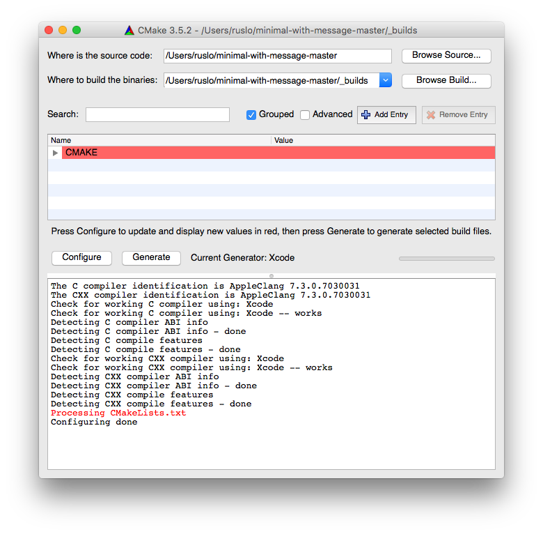
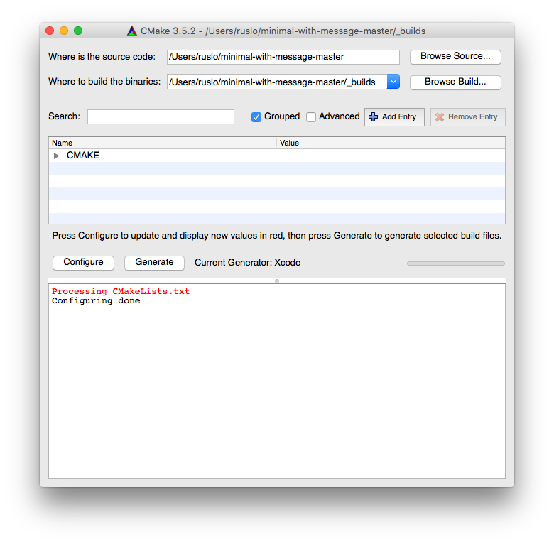
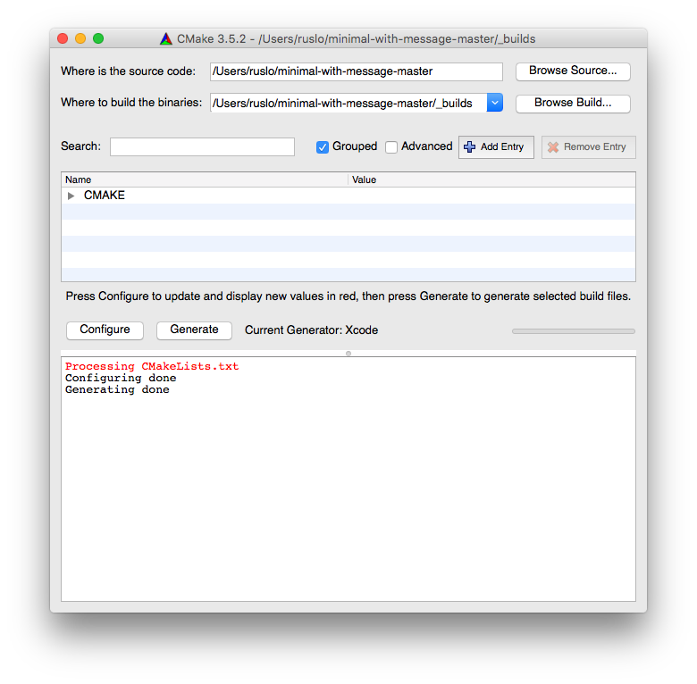

.. Copyright (c) 2016, Ruslan Baratov
.. All rights reserved.

CMake stages
------------

We start with theory. Let's introduce some terminology about
:ref:`CMake <CMake>` commands we have executed :doc:`before </first-step>`.

.. _configure:

Configure step
==============

In this step CMake will parse the top level :ref:`CMakeLists.txt <cmakelists.txt>`
of :ref:`source tree <source tree>` and create a
:ref:`CMakeCache.txt <cmakecache.txt>` file populated with
:ref:`cache variables <cache variables>`. Different types of variables will be
described further in detail. For CMake-GUI this step is triggered by clicking
on the ``Configure`` button. For CMake command-line this step is combined with
the generate step so terms configure and generate will be used interchangeably.
The end of this step is indicated by the ``Configuring done`` message from CMake.

.. terminology discussion:
.. * http://www.mail-archive.com/cmake%40cmake.org/msg55116.html

GUI + Xcode example
~~~~~~~~~~~~~~~~~~~

Let's add a `message <https://cmake.org/cmake/help/latest/command/message.html>`__
command to the example:

.. literalinclude:: /examples/minimal-with-message/CMakeLists.txt
  :language: cmake
  :emphasize-lines: 8

.. admonition:: Examples on GitHub

  * `Repository <https://github.com/cgold-examples/minimal-with-message>`__
  * `Latest ZIP <https://github.com/cgold-examples/minimal-with-message/archive/master.zip>`__

The line ``Processing CMakeLists.txt`` will be printed by CMake when parsing the
CMakeLists.txt file, i.e. on the configure step. Open CMake-GUI, setup directories
and hit ``Configure``:

You can verify that there is no Xcode project generated yet, but only
CMakeCache.txt with cache variables:

.. code-block:: none

  [minimal-with-message-master]> ls _builds
  CMakeCache.txt CMakeFiles/

Let's run configure one more time:

We still see the ``Process CMakeLists.txt`` message which means that CMakeLists.txt
was parsed again but there is no check/detect messages. This is because
information about compiler and different tools detection results were saved
in CMake internal directories and reused. You may notice that the second run
happens much faster than the first.

No surprises, there is still no Xcode project:

.. code-block:: none

  [minimal-with-message-master]> ls _builds
  CMakeCache.txt CMakeFiles/

.. _generate:

Generate step
=============

In this step CMake will generate :ref:`native build tool <native build tool>`
files using information from CMakeLists.txt and variables from CMakeCache.txt.
For CMake-GUI this step triggered by clicking on the ``Generate`` button.
For CMake command-line this step is combined with the configure step.
The end of this step is indicated by the ``Generating done`` message from CMake.

GUI + Xcode example
~~~~~~~~~~~~~~~~~~~

Hit ``Generate`` now:

Now the Xcode project is created:

.. code-block:: none

  [minimal-with-message-master]> ls -d _builds/foo.xcodeproj
  _builds/foo.xcodeproj/

Makefile example
~~~~~~~~~~~~~~~~

An example of generating a Makefile on Linux:

.. code-block:: none
  :emphasize-lines: 2, 17

  [minimal-with-message-master]> rm -rf _builds
  [minimal-with-message-master]> cmake -H. -B_builds
  -- The C compiler identification is GNU 4.8.4
  -- The CXX compiler identification is GNU 4.8.4
  -- Check for working C compiler: /usr/bin/cc
  -- Check for working C compiler: /usr/bin/cc -- works
  -- Detecting C compiler ABI info
  -- Detecting C compiler ABI info - done
  -- Detecting C compile features
  -- Detecting C compile features - done
  -- Check for working CXX compiler: /usr/bin/c++
  -- Check for working CXX compiler: /usr/bin/c++ -- works
  -- Detecting CXX compiler ABI info
  -- Detecting CXX compiler ABI info - done
  -- Detecting CXX compile features
  -- Detecting CXX compile features - done
  Processing CMakeLists.txt
  -- Configuring done
  -- Generating done
  -- Build files have been written to: /.../minimal-with-message-master/_builds

We see the ``Processing CMakeLists.txt``, ``Configuring done`` and
``Generating done`` messages, meaning that CMakeLists.txt was parsed and
both configure/generate steps were combined into one action.

Verify the Makefile was generated:

.. code-block:: none

  [minimal-with-message-master]> ls _builds/Makefile
  _builds/Makefile

If you run configure again CMakeLists.txt will be parsed one more time and
``Processing CMakeLists.txt`` will be printed:

.. code-block:: none
  :emphasize-lines: 2

  [minimal-with-message-master]> cmake -H. -B_builds
  Processing CMakeLists.txt
  -- Configuring done
  -- Generating done
  -- Build files have been written to: /.../minimal-with-message-master/_builds

.. _build:

Build step
==========

This step is orchestrated by the native build tool. In this step targets of your
project will be built.

Xcode example
~~~~~~~~~~~~~

Run the native tool build:

.. code-block:: none
  :emphasize-lines: 13, 19

  [minimal-with-message-master]> cmake --build _builds

  === BUILD AGGREGATE TARGET ZERO_CHECK OF PROJECT foo WITH CONFIGURATION Debug ===

  Check dependencies

  ...

  === BUILD TARGET foo OF PROJECT foo WITH CONFIGURATION Debug ===

  ...

      /.../Xcode.app/Contents/Developer/Toolchains/XcodeDefault.xctoolchain/usr/bin/clang -x c++ ...
          -c /.../minimal-with-message-master/foo.cpp
          -o /.../minimal-with-message-master/_builds/foo.build/Debug/foo.build/Objects-normal/x86_64/foo.o

  ...

      /.../Xcode.app/Contents/Developer/Toolchains/XcodeDefault.xctoolchain/usr/bin/clang++ ...
          -o /Users/ruslo/minimal-with-message-master/_builds/Debug/foo

  === BUILD AGGREGATE TARGET ALL_BUILD OF PROJECT foo WITH CONFIGURATION Debug ===

  ...

  Build all projects

  ** BUILD SUCCEEDED **

You can see that ``foo.cpp`` was compiled into ``foo.o`` and then the executable ``foo``
created. There is no ``Processing CMakeLists.txt`` message in the output because during
this stage CMake doesn't parse CMakeLists.txt, however re-configure may be
triggered on the build step automatically, this will be shown in the
:doc:`workflow <workflow>` section.

Makefile example
~~~~~~~~~~~~~~~~

Run the native build tool:

.. code-block:: none

  [minimal-with-message-master]> cmake --build _builds
  Scanning dependencies of target foo
  [ 50%] Building CXX object CMakeFiles/foo.dir/foo.cpp.o
  [100%] Linking CXX executable foo
  [100%] Built target foo

You can see that ``foo.cpp`` is compiled into ``foo.cpp.o`` and then the executable ``foo``
created. There is no ``Processing CMakeLists.txt`` message in the output because during
this stage CMake doesn't parse CMakeLists.txt, however re-configure may be
triggered on the build step automatically, this will be shown in the
:doc:`workflow <workflow>` section.
