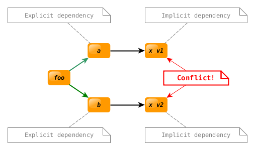

.. Copyright (c) 2018, Ruslan Baratov
.. All rights reserved.

.. spelling::

  rdparty

Bad way
-------

Merge sources
~~~~~~~~~~~~~

Assume we have library ``foo``:

.. code-block:: none

  src
  └── foo
      ├── foo.cpp
      └── foo.hpp

Library ``foo`` depends on library ``boo``:

.. code-block:: none

  src
  └── boo
      ├── boo.cpp
      └── boo.hpp

The worst thing you can do is to merge both sources by copying ``boo``
to the directory with ``foo``:

.. code-block:: none
  :emphasize-lines: 2-4

  src
  ├── boo
  │   ├── boo.cpp
  │   └── boo.hpp
  └── foo
      ├── foo.cpp
      └── foo.hpp

C++ directive ``#include <foo/foo.hpp>`` means that directory ``src/`` should
be in list of paths to headers (in terms of compilers like GCC: ``-I/.../src``).
We want our local directory to have **highest priority** if there are several
paths (e.g. if there are system wide paths and another copy of library ``foo``
installed system wide, then we want local copy to take a priority). Hence
whatever the rest of header paths is, the ``#include <boo/boo.hpp>`` of
dependent library ``boo`` will **always fall to our local copy**.
If somebody want to try to use another version of ``boo`` the only choice
you left to him is to remove ``src/boo`` directory.

Copy to "third_party" directory
~~~~~~~~~~~~~~~~~~~~~~~~~~~~~~~

Instead of copying to the same directory you can copy dependent library
to ``third_party`` directory:

.. code-block:: none
  :emphasize-lines: 6-8

  src
  └── foo
      ├── foo.cpp
      └── foo.hpp
  third_party
  └── boo
      ├── boo.cpp
      └── boo.hpp

There will be two independent paths to headers (at least): ``-I/.../src`` and
``-I/.../third_party`` hence if somebody want to try to use another version
of ``boo`` it's enough to modify CMake code without changing project structure.

Assuming that both libraries are under :ref:`VCS <VCS>` control, by
doing plain copy operation you're **losing information about version** of
``boo``. Also if you want to modify ``boo`` sources locally, then merging them
with update of ``boo`` from upstream might be not a trivial operation.

Git submodule
~~~~~~~~~~~~~

Using same structure you can keep information about version of ``boo`` by
adding it as a
`Git submodule <https://git-scm.com/book/en/v2/Git-Tools-Submodules>`__
instead of raw copying. Git functionality will help to track modification of
third party code and merging it with future releases.

Git submodules will work well for:

* Adding sources that are extension of your project, hence it makes no
  sense to add these sources to another project. I.e. submodule is used as
  a **dependency exactly for one node in dependency tree**.

* Managing dependencies in the project that can't be used as another dependency,
  i.e. **your project is the leaf in dependency tree**, like executable.
  Though this still may raise the question of size optimization when package
  manager is used, it will be better to use dependencies as a shared libraries.

* **Short period** of development when you're actively modifying third party
  code.

Submodule is not a good long term solution for managing dependencies that
can be reused. It leads to conflicts like this:

.. note::

  If we are talking about reusable library then you can't control final
  structure of dependency tree. If you are not experiencing such issue it
  doesn't mean the same will be true for somebody else.

At first you will simply get :ref:`target names conflict <target duplicates>`:

.. code-block:: none
  :emphasize-lines: 2, 18-20

  [examples]> rm -rf _builds
  [examples]> cmake -Hdep-examples/deps-submodule-conflict -B_builds
  -- The C compiler identification is GNU 5.4.1
  -- The CXX compiler identification is GNU 5.4.1
  -- Check for working C compiler: /usr/bin/cc
  -- Check for working C compiler: /usr/bin/cc -- works
  -- Detecting C compiler ABI info
  -- Detecting C compiler ABI info - done
  -- Detecting C compile features
  -- Detecting C compile features - done
  -- Check for working CXX compiler: /usr/bin/c++
  -- Check for working CXX compiler: /usr/bin/c++ -- works
  -- Detecting CXX compiler ABI info
  -- Detecting CXX compiler ABI info - done
  -- Detecting CXX compile features
  -- Detecting CXX compile features - done
  CMake Error at third_party/b/third_party/x/CMakeLists.txt:4 (add_library):
    add_library cannot create target "x" because another target with the same
    name already exists.  The existing target is a static library created in
    source directory "/.../third_party/a/third_party/x".

You can protect including of third party code by condition:

.. code-block:: cmake

  if(NOT TARGET x::x)
    add_subdirectory(third_party/x)
  endif()

It will solve target name conflict however it may lead to tricky behavior.
Effectively it will introduce "first win" strategy while doing dependency
resolution, mixing two separate concepts:

* Project structure

  * ``foo`` depends on ``a`` and ``b``
  * ``a`` depends on ``x``
  * ``b`` depends on ``x``

* Versions

  * Some ``a`` version available
  * Some ``b`` version available
  * Two versions of ``x`` available: ``v1.0`` and ``v2.0``

Options is a common way to customize your CMake code, often it's involve
the change of used dependencies and change of project structure. Let's add option
``FOO_WITH_A`` to the example to control optional dependency ``foo`` -> ``a``:

.. literalinclude:: /examples/dep-examples/deps-submodule-option/CMakeLists.txt
  :language: cmake
  :emphasize-lines: 4, 8-12

When option ``FOO_WITH_A`` is enabled the ``x`` dependency from ``a``
subdirectory will proceed first, hence ``v1.0`` will be used. And if
``FOO_WITH_A`` is disabled the ``x`` dependency from ``b`` subdirectory will
proceed first, hence ``v2.0`` will be used.

From user perspective it can be quite surprising and may look like some ``a``
functionality is leaking into module ``b``:

.. code-block:: none
  :emphasize-lines: 2, 12-13

  [examples]> rm -rf _builds
  [examples]> cmake -Hdep-examples/deps-submodule-option -B_builds -DFOO_WITH_A=ON
  ...
  [examples]> cmake --build _builds
  ...
  [examples]> cd _builds
  [examples/_builds]> ctest -V
  1: Test command: /.../examples/_builds/foo
  1: Test timeout computed to be: 9.99988e+06
  1: Running 'a' module
  1: x say: nice
  1: Running 'b' module
  1: x say: nice
  1/1 Test #1: foo ..............................   Passed    0.00 sec

Disable module ``a`` and behavior of ``b`` changed!

.. code-block:: none
  :emphasize-lines: 2, 12-13

  [examples]> rm -rf _builds
  [examples]> cmake -Hdep-examples/deps-submodule-option -B_builds -DFOO_WITH_A=OFF
  ...
  [examples]> cmake --build _builds
  ...
  [examples]> cd _builds
  [examples/_builds]> ctest -V
  1: Test command: /.../examples/_builds/foo
  1: Test timeout computed to be: 9.99988e+06
  1: Running 'a' module
  1: (Module 'a' disabled)
  1: Running 'b' module
  1: x say: good
  1/1 Test #1: foo ..............................   Passed    0.00 sec

.. note::

  Such behavior can be "stabilized" by adding ``foo`` -> ``x`` dependency:

  .. code-block:: cmake

    # before 'a' and 'b'
    add_subdirectory(third_party/x)

    if(FOO_WITH_A)
      add_subdirectory(third_party/a)
    endif()
    add_subdirectory(third_party/b)

  But this obviously doesn't scale well since ``x`` is an implicit dependency
  and we have no control over whether it will be used in future ``a``/``b``
  releases or more dependencies will be introduced or on which options/platforms
  they depends, etc.

Since version of ``x`` tied to project structure every time you switch option
``FOO_WITH_A`` the whole project will rebuild:

.. code-block:: none
  :emphasize-lines: 2

  [examples]> rm -rf _builds
  [examples]> cmake -Hdep-examples/deps-submodule-option -B_builds -DFOO_WITH_A=ON

Build everything from scratch first time:

.. code-block:: none
  :emphasize-lines: 1

  [examples]> cmake --build _builds
  Scanning dependencies of target x
  [ 12%] Building CXX object third_party/a/third_party/x/CMakeFiles/x.dir/x/x.cpp.o
  [ 25%] Linking CXX static library libx.a
  [ 25%] Built target x
  Scanning dependencies of target b
  [ 37%] Building CXX object third_party/b/CMakeFiles/b.dir/b/b.cpp.o
  [ 50%] Linking CXX static library libb.a
  [ 50%] Built target b
  Scanning dependencies of target a
  [ 62%] Building CXX object third_party/a/CMakeFiles/a.dir/a/a.cpp.o
  [ 75%] Linking CXX static library liba.a
  [ 75%] Built target a
  Scanning dependencies of target foo
  [ 87%] Building CXX object CMakeFiles/foo.dir/foo.cpp.o
  [100%] Linking CXX executable foo
  [100%] Built target foo

Second time just checking:

.. code-block:: none
  :emphasize-lines: 1

  [examples]> cmake --build _builds
  [ 25%] Built target x
  [ 50%] Built target b
  [ 75%] Built target a
  [100%] Built target foo

Disable component ``a``:

.. code-block:: none

  [examples]> cmake -Hdep-examples/deps-submodule-option -B_builds -DFOO_WITH_A=OFF

Whole project rebuild!

.. code-block:: none
  :emphasize-lines: 1

  [examples]> cmake --build _builds
  Scanning dependencies of target x
  [ 16%] Building CXX object third_party/b/third_party/x/CMakeFiles/x.dir/x/x.cpp.o
  [ 33%] Linking CXX static library libx.a
  [ 33%] Built target x
  Scanning dependencies of target b
  [ 50%] Building CXX object third_party/b/CMakeFiles/b.dir/b/b.cpp.o
  [ 66%] Linking CXX static library libb.a
  [ 66%] Built target b
  Scanning dependencies of target foo
  [ 83%] Building CXX object CMakeFiles/foo.dir/foo.cpp.o
  [100%] Linking CXX executable foo
  [100%] Built target foo

Summary
~~~~~~~

The best way to introduce bundled dependency is to add it to the separate
directory like ``third_party`` as a submodule.

The downsides of such approach:

* ``add_subdirectory`` is **not a shareable solution**. Each
  ``add_subdirectory(third_party/x)`` block from different projects has it's
  own copy of ``x`` artifacts. Every time you start new project and add
  ``add_subdirectory(third_party/x)`` you're building ``x`` from scratch.
  It's not convenient if such build takes a long time.

* Dependency resolution **is not option friendly**.

.. seealso::

  * `Why not bundle dependencies <https://wiki.gentoo.org/wiki/Why_not_bundle_dependencies>`__
