.. Copyright (c) 2016, Ruslan Baratov
.. All rights reserved.

Cache variables
---------------

Cache variables saved in :ref:`CMakeCache.txt` file:

.. literalinclude:: /examples/usage-of-variables/cache-cmakecachetxt/CMakeLists.txt
  :language: cmake
  :emphasize-lines: 4

.. code-block:: shell
  :emphasize-lines: 2, 7

  [usage-of-variables]> rm -rf _builds
  [usage-of-variables]> cmake -Hcache-cmakecachetxt -B_builds
  -- Configuring done
  -- Generating done
  -- Build files have been written to: /.../usage-of-variables/_builds
  [usage-of-variables]> grep abc _builds/CMakeCache.txt
  abc:STRING=687

No scope
========

Unlike regular CMake variables cache variables have no scope and is set globally:

.. literalinclude:: /examples/usage-of-variables/cache-no-scope/CMakeLists.txt
  :language: cmake
  :emphasize-lines: 6, 8

.. literalinclude:: /examples/usage-of-variables/cache-no-scope/boo/CMakeLists.txt
  :language: cmake
  :emphasize-lines: 3

.. code-block:: shell
  :emphasize-lines: 2-3

  [usage-of-variables]> rm -rf _builds
  [usage-of-variables]> cmake -Hcache-no-scope -B_builds
  A: 123
  -- Configuring done
  -- Generating done
  -- Build files have been written to: /.../usage-of-variables/_builds

Double set
==========

If variable is already in cache then command ``set(... CACHE ...)`` will have no
effect - old variable will be used still:

.. literalinclude:: /examples/usage-of-variables/double-set/1/CMakeLists.txt
  :language: cmake
  :emphasize-lines: 4

.. code-block:: shell
  :emphasize-lines: 1, 3-4, 9

  [usage-of-variables]> rm -rf _builds
  [usage-of-variables]> cp double-set/1/CMakeLists.txt double-set/
  [usage-of-variables]> cmake -Hdouble-set -B_builds
  Variable from cache: 123
  -- Configuring done
  -- Generating done
  -- Build files have been written to: /.../usage-of-variables/_builds
  [usage-of-variables]> grep abc _builds/CMakeCache.txt
  abc:STRING=123

Update :ref:`CMakeLists.txt <cmakelists.txt>` (don't remove cache!):

.. literalinclude:: /examples/usage-of-variables/double-set/2/CMakeLists.txt
  :diff: /examples/usage-of-variables/double-set/1/CMakeLists.txt

.. code-block:: shell
  :emphasize-lines: 2-3, 8

  [usage-of-variables]> cp double-set/2/CMakeLists.txt double-set/
  [usage-of-variables]> cmake -Hdouble-set -B_builds
  Variable from cache: 123
  -- Configuring done
  -- Generating done
  -- Build files have been written to: /.../usage-of-variables/_builds
  [usage-of-variables]> grep abc _builds/CMakeCache.txt
  abc:STRING=123

-D
==

Cache variable can be set by ``-D`` command line option. Unlike
``set(... CACHE ...)`` command, variable that set by ``-D`` option take
priority:

.. code-block:: shell
  :emphasize-lines: 1-2, 7

  [usage-of-variables]> cmake -Dabc=444 -Hdouble-set -B_builds
  Variable from cache: 444
  -- Configuring done
  -- Generating done
  -- Build files have been written to: /.../usage-of-variables/_builds
  [usage-of-variables]> grep abc _builds/CMakeCache.txt
  abc:STRING=444

Initial cache
=============

If there are a lot of variables to set it's not so convenient to use ``-D``.
In this case user can define all variables in separate file and load
it by ``-C``:

.. literalinclude:: /examples/usage-of-variables/initial-cache/cache.cmake
  :language: cmake
  :emphasize-lines: 3-5

.. literalinclude:: /examples/usage-of-variables/initial-cache/CMakeLists.txt
  :language: cmake
  :emphasize-lines: 6-8

.. code-block:: shell
  :emphasize-lines: 2, 4-6

  [usage-of-variables]> rm -rf _builds
  [usage-of-variables]> cmake -C initial-cache/cache.cmake -Hinitial-cache -B_builds
  loading initial cache file initial-cache/cache.cmake
  A: 123
  B: 456
  C: 789
  -- Configuring done
  -- Generating done
  -- Build files have been written to: /.../usage-of-variables/_builds

Force
=====

If you want to set cache variable even if it's already present in cache file
you can add ``FORCE``:

.. literalinclude:: /examples/usage-of-variables/force/CMakeLists.txt
  :language: cmake
  :emphasize-lines: 4

.. code-block:: shell
  :emphasize-lines: 2-3

  [usage-of-variables]> rm -rf _builds
  [usage-of-variables]> cmake -DA=456 -Hforce -B_builds
  A: 123
  -- Configuring done
  -- Generating done
  -- Build files have been written to: /.../usage-of-variables/_builds

This is quite surprising behavior for user and conflicts with the nature of
cache variables that designed to store variable once and globally.

.. warning::

  ``FORCE`` usually is an indicator of badly designed CMake code.

Force as a workaround
=====================

``FORCE`` can be used to fix the problem that described
:ref:`eariler <cache confusing>`:

.. literalinclude:: /examples/usage-of-variables/no-force-confuse/CMakeLists.txt
  :language: cmake
  :emphasize-lines: 4-5

.. code-block:: shell
  :emphasize-lines: 2-3, 7-8

  [usage-of-variables]> rm -rf _builds
  [usage-of-variables]> cmake -Hno-force-confuse -B_builds
  A: 456
  -- Configuring done
  -- Generating done
  -- Build files have been written to: /.../usage-of-variables/_builds
  [usage-of-variables]> cmake -Hno-force-confuse -B_builds
  A: 123
  -- Configuring done
  -- Generating done
  -- Build files have been written to: /.../usage-of-variables/_builds

With ``FORCE`` variable will be set even it's already present in cache, so
regular variable with the same name will be unset too each time:

.. literalinclude:: /examples/usage-of-variables/force-workaround/CMakeLists.txt
  :language: cmake
  :emphasize-lines: 4-5

.. code-block:: shell
  :emphasize-lines: 2-3, 7-8

  [usage-of-variables]> rm -rf _builds
  [usage-of-variables]> cmake -Hforce-workaround -B_builds
  A: 456
  -- Configuring done
  -- Generating done
  -- Build files have been written to: /.../usage-of-variables/_builds
  [usage-of-variables]> cmake -Hforce-workaround -B_builds
  A: 456
  -- Configuring done
  -- Generating done
  -- Build files have been written to: /.../usage-of-variables/_builds

Cache type
==========

Though type of any variable is **always** string you can add some hints which
will be used by CMake-GUI:

.. literalinclude:: /examples/usage-of-variables/cache-type/CMakeLists.txt
  :language: cmake
  :emphasize-lines: 4-7

Run configure:

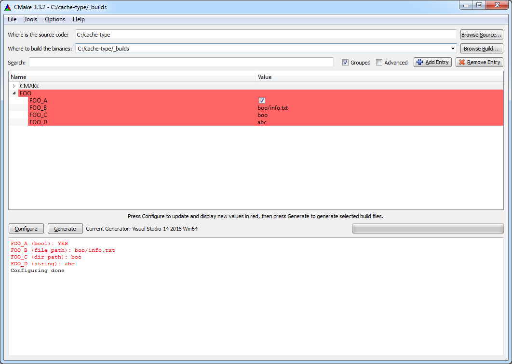

Variable ``FOO_A`` will be treated as boolean. Uncheck box and run configure:

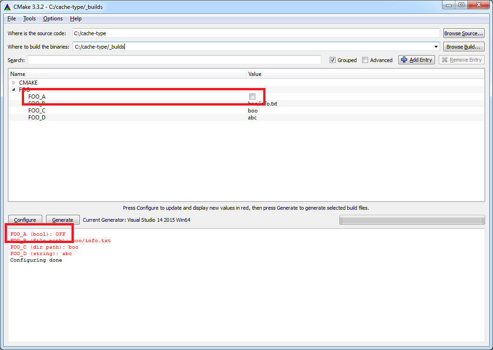

Variable ``FOO_B`` will be treated as path to the file. Click on ``...``:

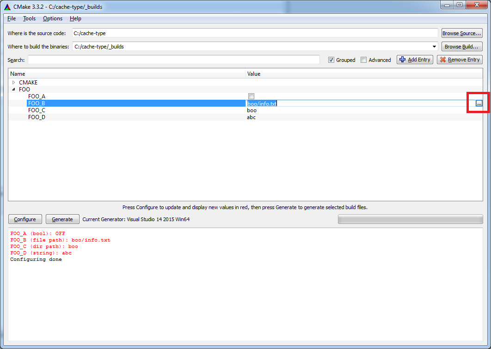

Select file:

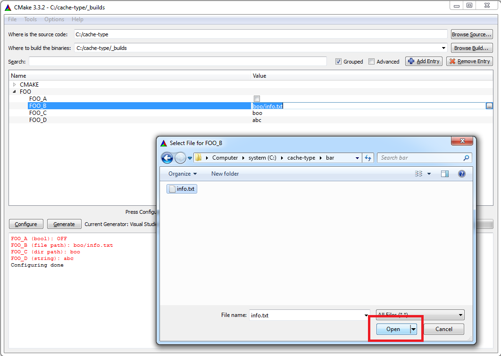

Run configure:

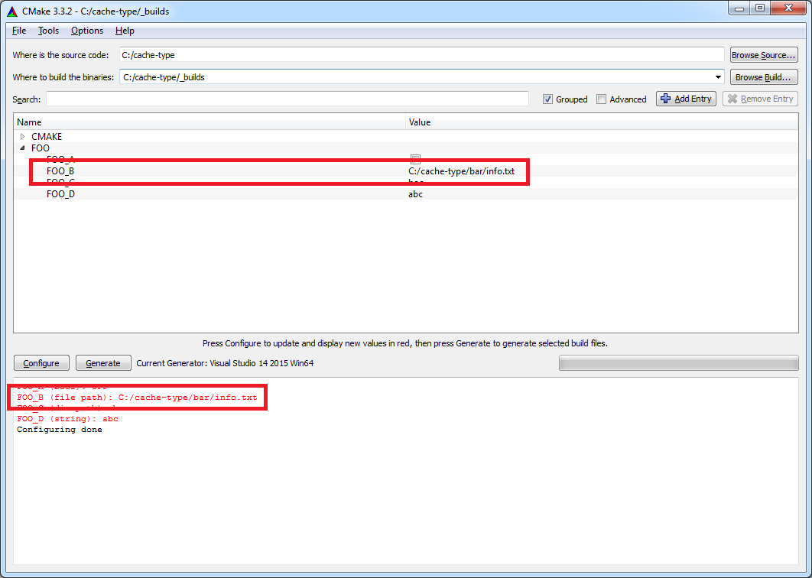

Variable ``FOO_C`` will be treated as path to directory. Click on ``...``:

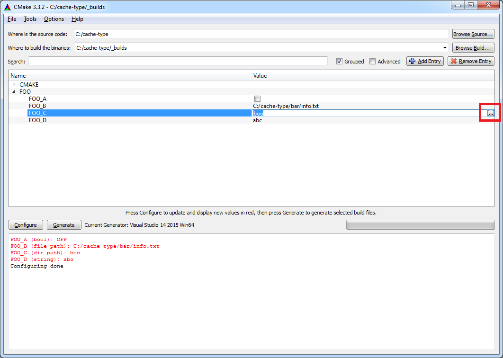

Select directory:

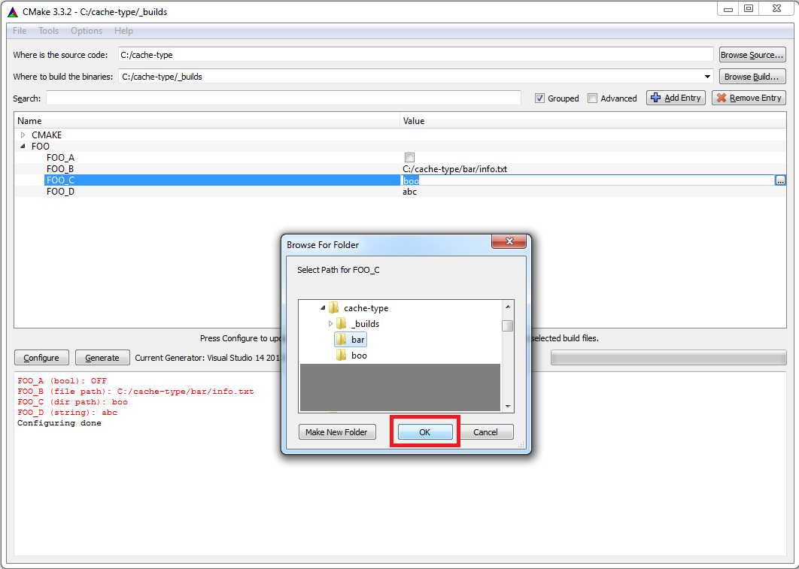

Run configure:

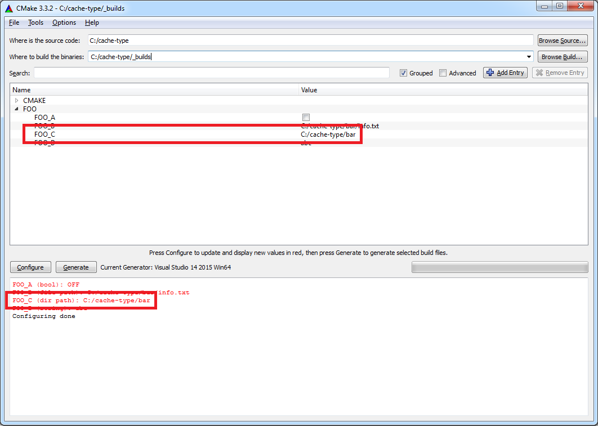

Variable ``FOO_D`` will be treated as string. Click near variable name and
edit:

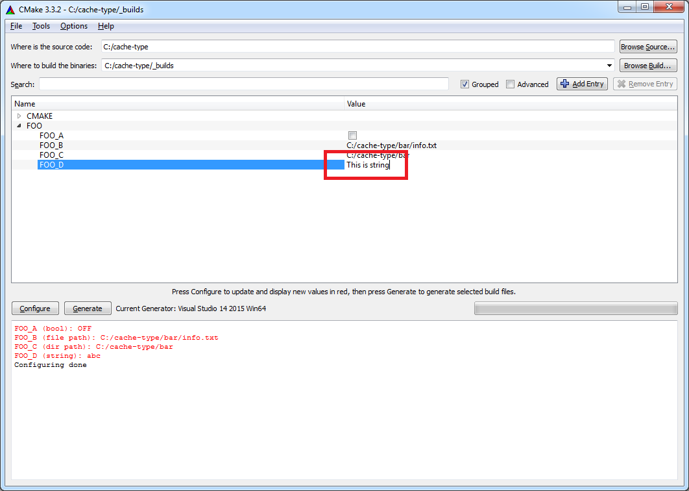

Run configure:

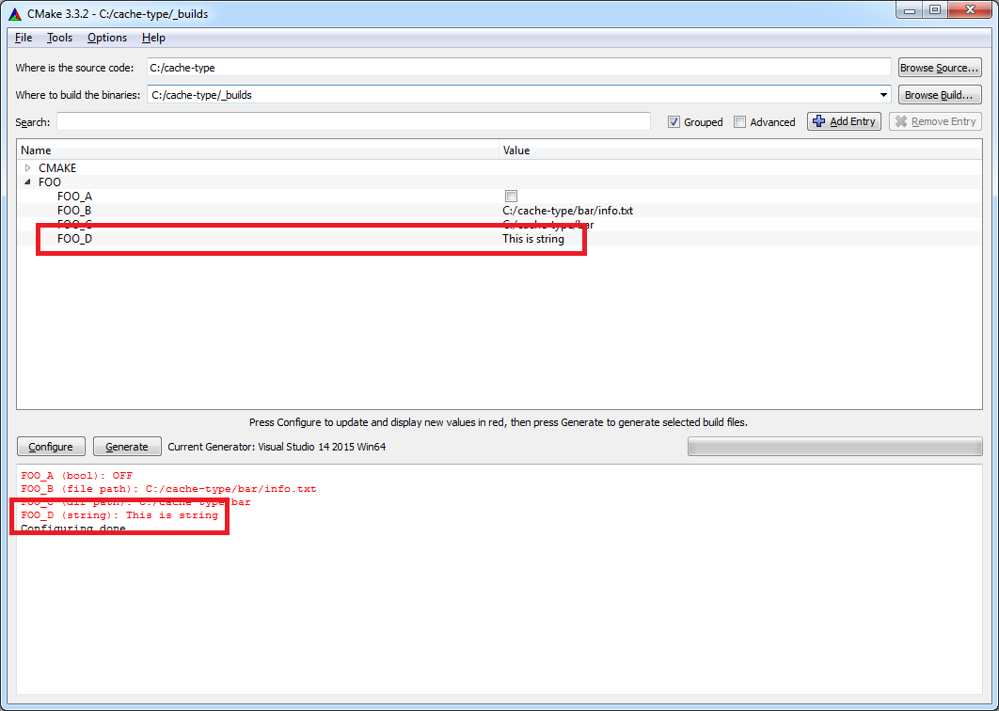

Description of variable:

.. literalinclude:: /examples/usage-of-variables/cache-type/CMakeLists.txt
  :language: cmake
  :emphasize-lines: 7

Will pop-up as a hint for users:

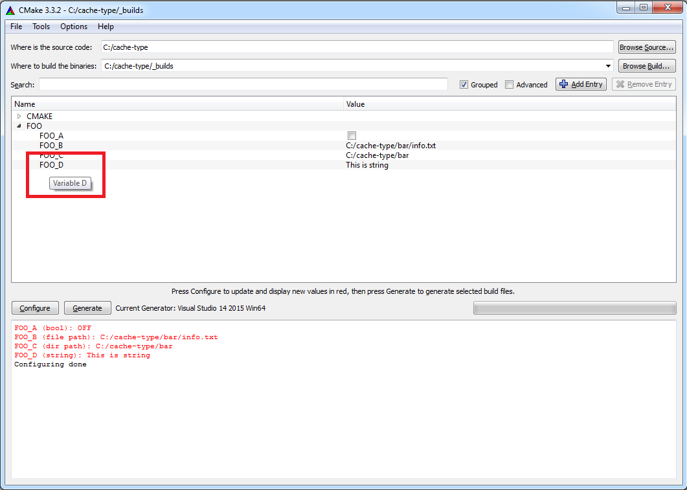

.. admonition:: CMake documentation

  * `Cache entry <https://cmake.org/cmake/help/latest/command/set.html#set-cache-entry>`__

Enumerate
=========

Selection widget can be created for variable of string type:

.. literalinclude:: /examples/usage-of-variables/cache-enum/CMakeLists.txt
  :language: cmake
  :emphasize-lines: 4, 6

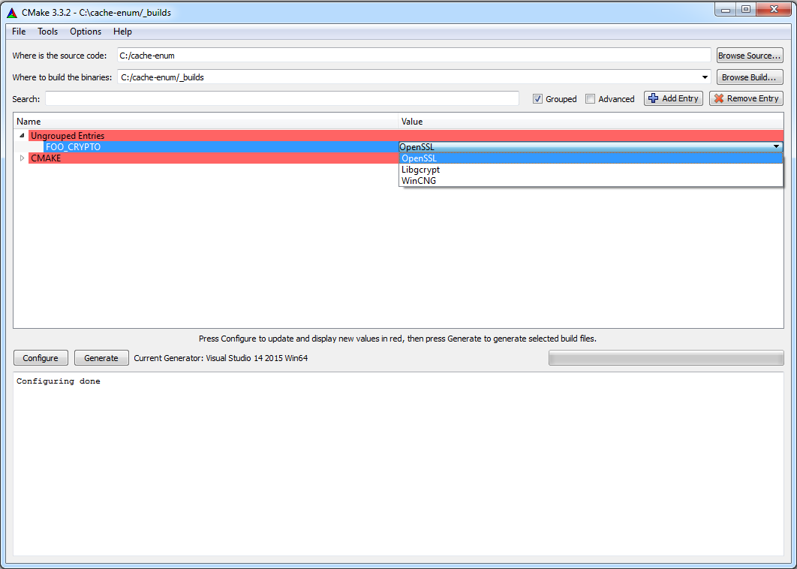

.. admonition:: CMake documentation

  * `STRINGS property <https://cmake.org/cmake/help/latest/prop_cache/STRINGS.html>`__

Internal
========

Variable with type ``INTERNAL`` will not be shown in CMake-GUI (again, real type
is a string still):

.. literalinclude:: /examples/usage-of-variables/internal-gui/CMakeLists.txt
  :language: cmake
  :emphasize-lines: 4-6

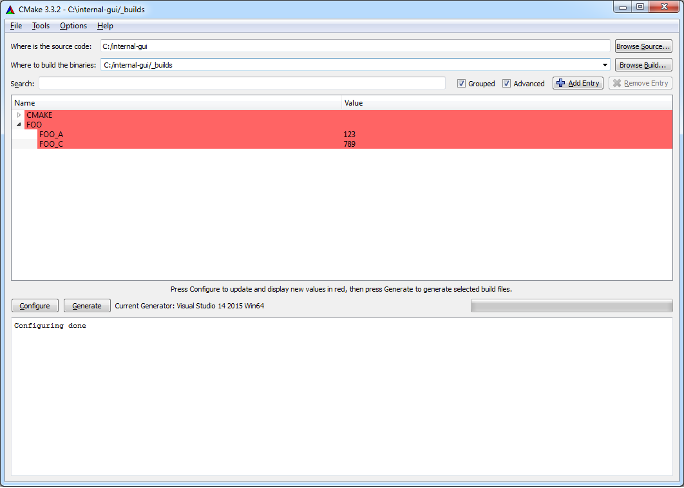

Also such type of variable implies ``FORCE``:

.. literalinclude:: /examples/usage-of-variables/internal-force/CMakeLists.txt
  :language: cmake
  :emphasize-lines: 4-6, 8-10

Variable ``FOO_A`` will be set to ``123`` then **rewritten** to ``456`` because
behavior is similar to variable **with FORCE**, then one more time to ``789``,
so final result is ``789``. Variable ``FOO_B`` is a cache variable with **no
FORCE** so first ``123`` will be set to cache, then since ``FOO_B`` is already
in cache ``456`` and ``789`` **will be ignored**, so final result is ``123``:

.. code-block:: shell
  :emphasize-lines: 2-4

  [usage-of-variables]> rm -rf _builds
  [usage-of-variables]> cmake -Hinternal-force -B_builds
  FOO_A (internal): 789
  FOO_B (string): 123
  -- Configuring done
  -- Generating done
  -- Build files have been written to: /.../usage-of-variables/_builds

Advanced
========

If variable is marked as advanced:

.. literalinclude:: /examples/usage-of-variables/advanced-gui/CMakeLists.txt
  :language: cmake
  :emphasize-lines: 5, 8

it will not be shown in CMake-GUI if ``Advanced`` checkbox is not set:

.. image:: cache-gui/14-gui-no-advanced.png
  :align: center

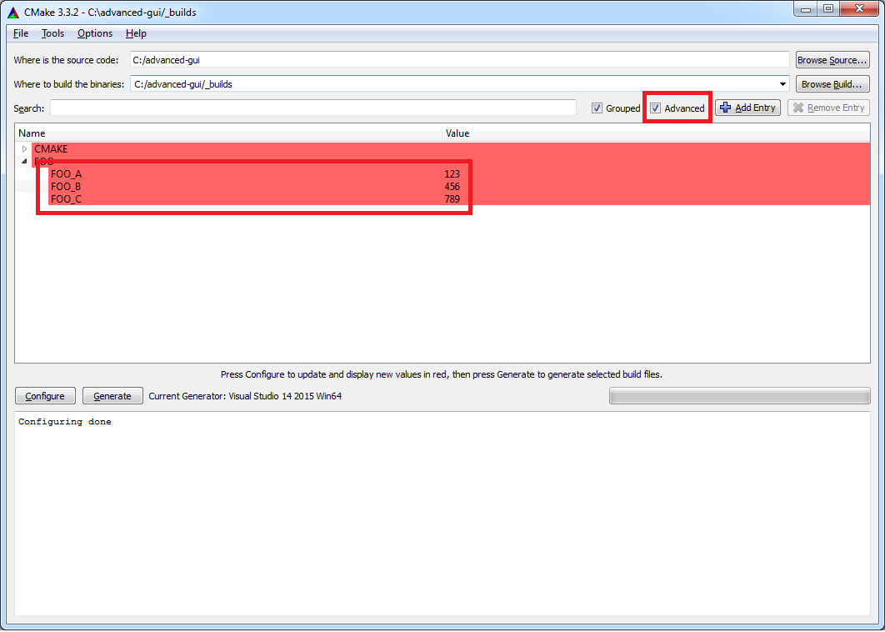

.. admonition:: CMake documentation

  * `mark_as_advanced <https://cmake.org/cmake/help/latest/command/mark_as_advanced.html>`__

Use case
========

.. _cache use case:

The ability of cache variables respect user's settings fits perfectly for
creating project's customization option:

.. literalinclude:: /examples/usage-of-variables/project-customization/CMakeLists.txt
  :language: cmake
  :emphasize-lines: 4-5

Default value:

.. code-block:: shell
  :emphasize-lines: 2-4

  [usage-of-variables]> rm -rf _builds
  [usage-of-variables]> cmake -Hproject-customization -B_builds
  FOO_A: Default value for A
  FOO_B: Default value for B
  -- Configuring done
  -- Generating done
  -- Build files have been written to: /.../usage-of-variables/_builds

User's value:

.. code-block:: shell
  :emphasize-lines: 1-2

  [usage-of-variables]> cmake -DFOO_A=User -Hproject-customization -B_builds
  FOO_A: User
  FOO_B: Default value for B
  -- Configuring done
  -- Generating done
  -- Build files have been written to: /.../usage-of-variables/_builds

Note that such approach doesn't work for regular CMake variable ``FOO_B``:

.. code-block:: shell
  :emphasize-lines: 1, 3

  [usage-of-variables]> cmake -DFOO_B=User -Hproject-customization -B_builds
  FOO_A: User
  FOO_B: Default value for B
  -- Configuring done
  -- Generating done
  -- Build files have been written to: /.../usage-of-variables/_builds

Option
======

Command ``option`` can be used for creating boolean cache entry:

.. literalinclude:: /examples/usage-of-variables/option/CMakeLists.txt
  :language: cmake
  :emphasize-lines: 4-5

.. code-block:: shell
  :emphasize-lines: 2-4, 9-10

  [usage-of-variables]> rm -rf _builds
  [usage-of-variables]> cmake -Hoption -B_builds
  FOO_A: OFF
  FOO_B: ON
  -- Configuring done
  -- Generating done
  -- Build files have been written to: /.../usage-of-variables/_builds
  [usage-of-variables]> grep FOO_ _builds/CMakeCache.txt
  FOO_A:BOOL=OFF
  FOO_B:BOOL=ON

.. admonition:: CMake documentation

  * `option <https://cmake.org/cmake/help/latest/command/option.html>`__

.. _cache name recommendation:

Recommendation
==============

Because of the global nature of cache variables and options
(well it's cache too) you should do prefix it with the name of the project to
avoid clashing in case several projects are mixed together by
``add_subdirectory``:

.. literalinclude:: /examples/usage-of-variables/grouped-options/CMakeLists.txt
  :language: cmake
  :emphasize-lines: 6-7

.. literalinclude:: /examples/usage-of-variables/grouped-options/foo/CMakeLists.txt
  :language: cmake
  :emphasize-lines: 6-7

.. literalinclude:: /examples/usage-of-variables/grouped-options/boo/CMakeLists.txt
  :language: cmake
  :emphasize-lines: 6-7

.. seealso::

  * :ref:`Module names <module name recommendation>`
  * :ref:`Function names <function name recommendation>`

Besides the fact that both features can be set independently now also CMake-GUI
will group them nicely:

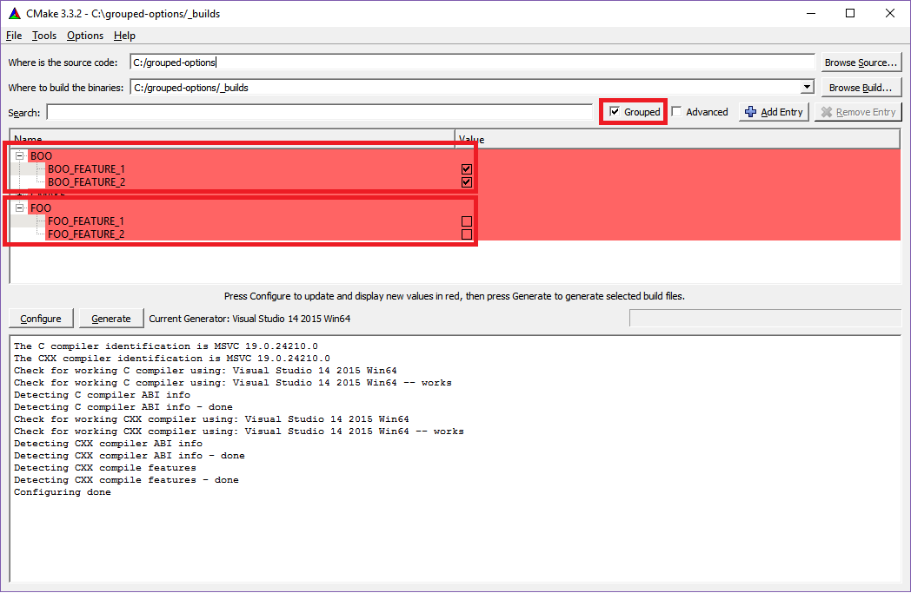

Summary
=======

* Use cache to set **global** variables
* Cache variables fits perfectly for expressing customized options: default
  value and respect user's value
* Type of cache variable helps CMake-GUI users
* Because of the global nature of cache variables to avoid clashing use prefixes
