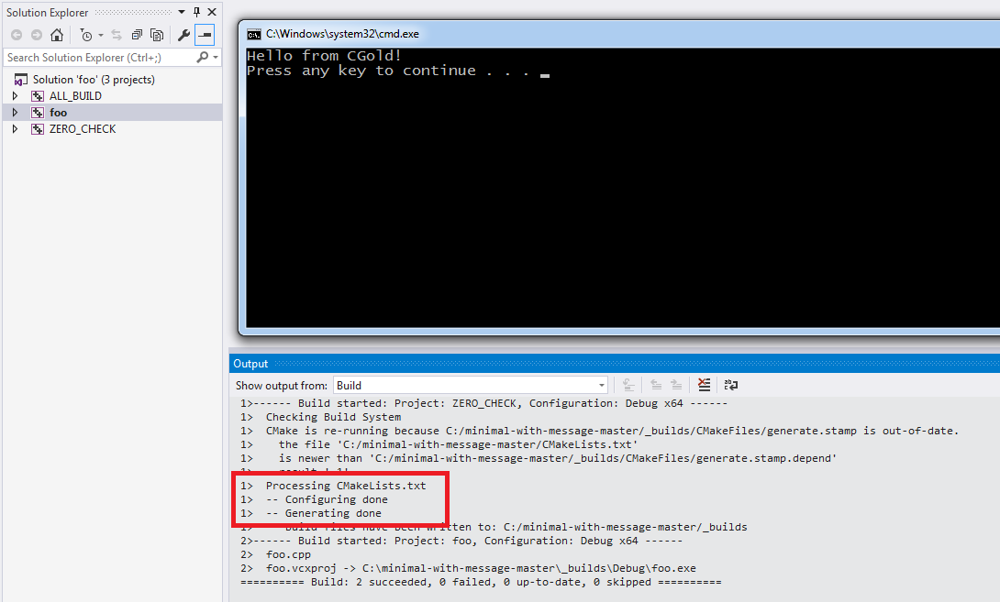
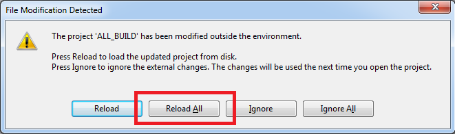
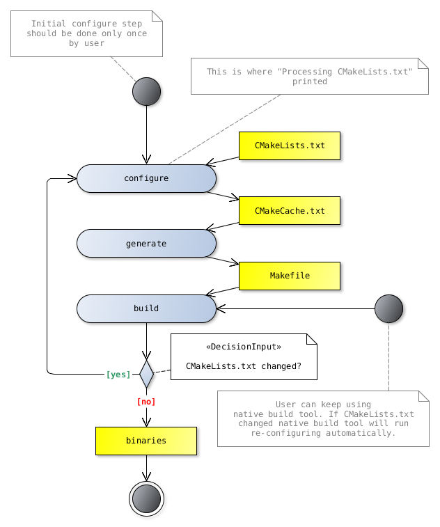

.. Copyright (c) 2016, Ruslan Baratov
.. All rights reserved.

Workflow
--------

There is a nice feature in :ref:`CMake <CMake>` that can greatly simplify
developer's workflow: :ref:`native build tool <native build tool>` will watch
CMake sources for changes and run re-configure step on update automatically. In
command-line terms it means that you have to run ``cmake -H. -B_builds`` **only
once**, you don't need to run configure again after modification of
CMakeLists.txt - you can keep using ``cmake --build``.

Makefile example
================

Back to the example with ``message``:

.. literalinclude:: /examples/minimal-with-message/CMakeLists.txt
  :language: cmake

.. admonition:: Examples on GitHub

  * `Repository <https://github.com/cgold-examples/minimal-with-message>`__
  * `Latest ZIP <https://github.com/cgold-examples/minimal-with-message/archive/master.zip>`__

Generate Makefile:

.. code-block:: none
  :emphasize-lines: 1, 16

  [minimal-with-message]> cmake -H. -B_builds
  -- The C compiler identification is GNU 4.8.4
  -- The CXX compiler identification is GNU 4.8.4
  -- Check for working C compiler: /usr/bin/cc
  -- Check for working C compiler: /usr/bin/cc -- works
  -- Detecting C compiler ABI info
  -- Detecting C compiler ABI info - done
  -- Detecting C compile features
  -- Detecting C compile features - done
  -- Check for working CXX compiler: /usr/bin/c++
  -- Check for working CXX compiler: /usr/bin/c++ -- works
  -- Detecting CXX compiler ABI info
  -- Detecting CXX compiler ABI info - done
  -- Detecting CXX compile features
  -- Detecting CXX compile features - done
  Processing CMakeLists.txt
  -- Configuring done
  -- Generating done
  -- Build files have been written to: /.../minimal-with-message/_builds

And run build:

.. code-block:: none

  [minimal-with-message]> cmake --build _builds
  Scanning dependencies of target foo
  [ 50%] Building CXX object CMakeFiles/foo.dir/foo.cpp.o
  [100%] Linking CXX executable foo
  [100%] Built target foo

Executable ``foo`` created from ``foo.cpp`` source. Make tool knows that if
there are no changes in ``foo.cpp`` then no need to build and link executable.
If you run build again there will be no compile and link stage:

.. code-block:: none

  [minimal-with-message]> cmake --build _builds
  [100%] Built target foo

Let's "modify" ``foo.cpp`` source:

.. code-block:: none

  [minimal-with-message]> touch foo.cpp
  [minimal-with-message]> cmake --build _builds
  Scanning dependencies of target foo
  [ 50%] Building CXX object CMakeFiles/foo.dir/foo.cpp.o
  [100%] Linking CXX executable foo
  [100%] Built target foo

Make detects that executable ``foo`` is out-of-date and rebuild it. Well, that's
what build systems designed for :)

Now let's "change" CMakeLists.txt. Do we need to run ``cmake -H. -B_builds``
again? The answer is NO - just keep using ``cmake --build _builds``.
CMakeLists.txt added as dependent file to the Makefile:

.. code-block:: none
  :emphasize-lines: 1, 3

  [minimal-with-message]> touch CMakeLists.txt
  [minimal-with-message]> cmake --build _builds
  Processing CMakeLists.txt
  -- Configuring done
  -- Generating done
  -- Build files have been written to: /.../minimal-with-message/_builds
  [100%] Built target foo

You see ``Processing CMakeLists.txt``, ``Configuring done`` and
``Generating done`` indicating that CMake code parsed again and new Makefile
generated. Since we don't change the way target ``foo`` is built (like adding
new build flags or compile definitions) there is no compile/link stages.

If you "modify" both CMake and C++ code you will see the full
configure/generate/build stack of commands:

.. code-block:: none
  :emphasize-lines: 1, 3

  [minimal-with-message]> touch CMakeLists.txt foo.cpp
  [minimal-with-message]> cmake --build _builds
  Processing CMakeLists.txt
  -- Configuring done
  -- Generating done
  -- Build files have been written to: /.../minimal-with-message/_builds
  Scanning dependencies of target foo
  [ 50%] Building CXX object CMakeFiles/foo.dir/foo.cpp.o
  [100%] Linking CXX executable foo
  [100%] Built target foo

Visual Studio example
=====================

Same is true for other generators as well. For example when you touch
CMakeLists.txt and try to run ``foo`` target in Visual Studio:

IDE will notify you about update of the project. You can click "Reload All"
to reload new configuration:

.. _workflow:

UML activity diagram
====================

`Activity diagram <http://yed-uml.readthedocs.io/en/latest/activity-diagram.html>`__
for workflow described above:

Suspicious behavior
===================

If your workflow doesn't match configure-once approach then it may be a
symptom of wrongly written CMake code. Especially when you have to run
``cmake -H. -B_builds`` twice or when ``cmake --build _builds`` doesn't catch
updates from CMake code.

.. admonition:: CMake issue

  * `XCode: Real targets do not depend on ZERO_CHECK <https://gitlab.kitware.com/cmake/cmake/issues/14297>`__
